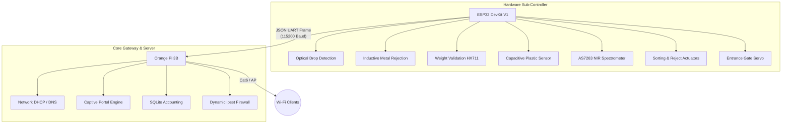

# Smart Eco-Fi Vendo System - Builder Manual

> [!NOTE]
> This manual serves as the comprehensive guide for assembling, wiring, programming, and deploying the Smart Eco-Fi Reverse Vending Machine. The system trades plastic bottles for Wi-Fi hotspot access.

## 1. System Architecture

The machine uses a **Distributed Hybrid Architecture** to guarantee precise, real-time hardware control while providing robust network management.



## 2. Bill of Materials (BOM)

### Computing & Networking
| Component | Qty | Engineering Purpose |
|---|---|---|
| **Orange Pi Zero 3 / 3B** | 1 | Linux routing, captive portal, iptables firewall |
| **ESP32 DevKit V1** | 1 | Real-time anti-cheat sensing, motor control |

### Actuators & Mechanics
| Component | Qty | Engineering Purpose |
|---|---|---|
| **MG995 Servo Motor** | 2 | 1x Sorting Hatch Gate (GPIO 13), 1x Entrance Gate (GPIO 21) |
| **MicroSD Card (32GB)** | 1 | OS storage, SQLite DB, system logs |
| **Outdoor AP (TP-Link)**| 1 | Long-range Wi-Fi broadcasting |

### Sensors, Actuation & UI
| Component | Qty | Engineering Purpose |
|---|---|---|
| **E18-D80NK IR Sensor** | 2 | Dual optical beam-break to verify complete drop |
| **1kg-5kg Load Cell** | 1 | Mass validation (10g–65g empty PET threshold) |
| **LJ12A3-4-Z/BX Sensor**| 1 | Inductive proximity to reject metal/tin cans |
| **Capacitive Proximity**| 1 | Rejects empty air / ensures non-metal object presence |
| **AS7263 NIR Sensor**   | 1 | Near-Infrared spectrometer to verify PET plastic signature |
| **MG996R Servo** | 1 | Actuates drop hatch trapdoor |
| **12V Solenoid** | 1 | Push-Pull open frame to eject rejected items |
| **20x4 I2C LCD** | 1 | System status prompts |
| **Feedback Elements** | 1 | 5V Buzzer, Green/Red LEDs |

### Power Distribution
| Component | Qty | Engineering Purpose |
|---|---|---|
| **12V 5A SMPS** | 1 | Main system power supply |
| **XL4015 Buck (5A)** | 1 | Steps down to 5.1V for logic rails |
| **LM2596 Buck (3A)** | 1 | Steps down to 5.0V for isolated motor power |

---

## 3. Hardware Assembly & Wiring

> [!WARNING]
> Do not mix the **Logic Rail** (5.1V) and **Motor Rail** (5.0V). The MG996R servo must be strictly isolated to the LM2596 buck converter to prevent brownouts on the ESP32.

### Detailed ESP32 Wiring & Pin-to-Pin Connections

| Module | ESP32 Pin | Module Pin | Power Supply | Special Notes |
|---|---|---|---|---|
| **Top IR (E18-D80NK #1)** | GPIO 18 | OUT (Black) | 5V Rail (Brown), GND (Blue) | Use `INPUT_PULLUP`. |
| **Bottom IR (E18-D80NK #2)**| GPIO 19 | OUT (Black) | 5V Rail (Brown), GND (Blue) | Use `INPUT_PULLUP`. |
| **Inductive Metal (LJ12A3)**| GPIO 23 | OUT (Black) | 12V Rail (Brown), GND (Blue) | **CRITICAL:** Use 10kΩ/10kΩ voltage divider from OUT to drop 12V signal to 3.3V logic! |
| **Capacitive Proximity** | GPIO 15 | OUT (Black) | 5V Rail (Brown), GND (Blue) | NPN Normally Open. Use `INPUT_PULLUP`. |
| **Load Cell (HX711)** | GPIO 4 (DT), GPIO 5 (SCK) | DOUT, PD_SCK | 3.3V (VCC), GND | Ensure load cell arrows point down. |
| **Bin Ultrasonic (JSN)** | GPIO 14 (Trig), GPIO 12 (Echo)| Trig, Echo | 5V Rail (VCC), GND | Level-shift the Echo pin to 3.3V logic (or use voltage divider). |
| **Hatch Servo (MG996R)** | GPIO 13 (PWM) | Signal (Orange) | 5.0V Motor Buck (Red), GND | **CRITICAL:** Servo power must come from isolated LM2596 motor rail. Tie grounds together. |
| **Reject Solenoid (12V)** | GPIO 32 | Gate of IRLZ44N | 12V Rail | Use IRLZ44N MOSFET. Source to GND, Drain to Solenoid(-). Solenoid(+) to 12V. Add 1N4007 flyback diode. |
| **20x4 LCD (I2C)** | GPIO 21 (SDA), GPIO 22 (SCL)| SDA, SCL | 5V Rail (VCC), GND | ESP32 is 3.3V logic, but LCD is 5V. I2C pullups usually work, but a logic level shifter is safer. |
| **AS7263 NIR Sensor** | GPIO 21 (SDA), GPIO 22 (SCL)| SDA, SCL | 3.3V (VIN), GND | Daisy-chained with LCD. |
| **Feedback Buzzer** | GPIO 33 | SIG / IN | 5V Rail (VCC), GND | Active low/high depending on module. |
| **Status LEDs** | GPIO 25 (Green), GPIO 26 (Red)| Anode | ESP32 GND | Use 220Ω series resistors for each. |

---

## 4. Software Setup: ESP32 (Sub-Controller)

The ESP32 is managed via PlatformIO. It handles the anti-fraud pipeline (Intake Scan -> Retention & Drop -> Validation -> Transmission).

1. Install **VSCode** and the **PlatformIO** extension.
2. Open the `d:\PROJECTS_IO\Plastic-Bottle-Vending-Machine` workspace.
3. The configuration is ready in [`platformio.ini`](file:///d:/PROJECTS_IO/Plastic-Bottle-Vending-Machine/platformio.ini).
4. Connect the ESP32 and click **Upload** in PlatformIO.

---

## 5. Software Setup: Orange Pi (Core Gateway)

The Orange Pi handles network authorization. When a valid drop occurs, the ESP32 sends `{"event":"CREDIT_ADD","bottles":1}`.

### Prerequisites
Install Armbian or OpenWrt. Then install the required packages:
```bash
sudo apt update
sudo apt install python3-pip ipset iptables sqlite3
pip3 install flask pyserial
```

### Deploying the Network & Portal Daemon
1. The unified portal script is located at [`host/portal.py`](file:///d:/PROJECTS_IO/Plastic-Bottle-Vending-Machine/host/portal.py). Ensure the `static` folder containing the banner image is also copied over.
2. Register the Systemd service (update `ExecStart` to point to `portal.py` instead of `daemon.py`):
```bash
sudo cp host/ecofi.service /etc/systemd/system/
sudo systemctl daemon-reload
sudo systemctl enable --now ecofi.service
```

---

## 6. Captive Portal (Wi-Fi Portal Page)

> [!TIP]
> The captive portal is how users pair their devices to the machine before depositing bottles.

### How it Works
1. When a user connects to the AP, they are redirected to the Portal Page.
2. The user lands on the portal endpoint which writes their IP address to `/tmp/current_active_client.txt`.
3. When the user drops a bottle, the background serial thread in `portal.py` reads the active IP file and increments the "Unclaimed Bottles" for that user.
4. When the user clicks the "Insert Plastic Bottles" button on the portal, it executes the `ipset` rule to grant them unrestricted internet access based on their bottle count.

### Setting up the Portal
A complete, mobile-responsive Flask portal imitating the Piso Wi-Fi interface has been generated in [`host/portal.py`](file:///d:/PROJECTS_IO/Plastic-Bottle-Vending-Machine/host/portal.py). 
Run it via Systemd, ensuring it binds to port 80:
```bash
sudo python3 /opt/ecofi/portal.py
```

### Captive DNS Redirection
To force the portal to pop up on phones, use `dnsmasq` and `iptables` to hijack port 80 traffic for unauthenticated users, routing them to the Flask server.

---

## 7. Calibration & Testing

1. **HX711 Calibration**: Place a 20g calibration weight on the intake cradle. Adjust `scale.set_scale(420.0);` in `main.cpp` until the reading accurately reflects 20.00g.
2. **Inductive Trimming**: Adjust the rear potentiometer on the LJ12A3-4-Z/BX sensor so that metal cans trigger detection at a 4mm–6mm distance.
3. **Capacitive Trimming**: Adjust the rear potentiometer on the capacitive proximity sensor so it triggers exactly when a plastic bottle is placed, but does *not* trigger falsely on the plastic walls of the intake chute.
4. **AS7263 NIR Calibration**: Place several standard PET bottles into the machine, record the 6-channel NIR absorption baseline via the Serial Monitor, and hardcode these thresholds into the validation logic.
5. **IR Distance Setup**: Turn the multi-turn screw on both E18-D80NK sensors until the rear LED indicates triggering exactly at the inner wall boundary of the chute (~15cm).
