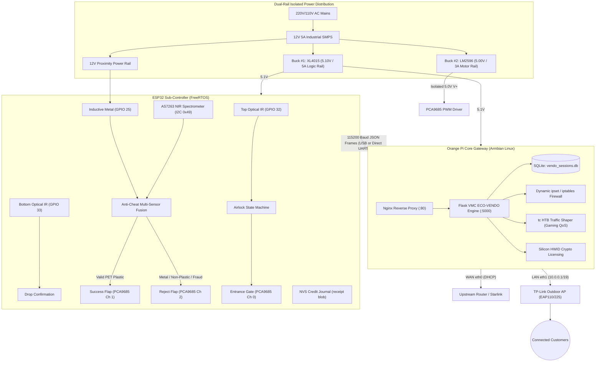

# VMC ECO-VENDO Reverse Vending Machine (PBVM) — Master Builder Manual
**Thesis Title:** *Eco-Vendo: An Empty Bottle-Initiated Internet Access Vending System*  
**Version:** 2.3.5 (Production-Hardened) · **Target Platform:** ESP32 DevKit V1 + Orange Pi One / PC (Allwinner H2+/H3)

> [!IMPORTANT]
> This manual is the authoritative hardware assembly, pinout, wiring, firmware configuration, and deployment manual for the **VMC ECO-VENDO Reverse Vending Machine (PBVM)**. It covers physical component interconnects, electrical signal conditioning, dual-rail power isolation, micro-controller communication, and Linux gateway setup.

---

## 1. System Architecture & Distributed Processing

VMC ECO-VENDO implements an industrial **Distributed Master-Subordinate Architecture**:
- **Hardware Sub-Controller (ESP32 DevKit V1):** Executes a deterministic FreeRTOS dual-core firmware pipeline. Handles nanosecond-precision optical and inductive sensor sampling, AS7263 NIR spectroscopy, a 3-servo motorized airlock chute, local I2C displays, audible/visual feedback, and NVS non-volatile credit journal storage.
- **Core Linux Gateway (Orange Pi One / PC):** Runs Armbian Linux (Debian Stretch, Python 3.5.3 target runtime). Operates an Nginx reverse proxy (Port 80) intercepting captive portal detection probes (`/generate_204`, `/connecttest.txt`, `ncsi.txt`), a multi-threaded Flask time entitlement engine (Port 5000), an atomic SQLite session database (`vendo_sessions.db`), Linux `tc` HTB bandwidth control, dynamic `ipset` packet filtering, cryptographic Silicon HWID licensing (`mclards23`), and Excel operational reporting.



---

## 2. Complete Bill of Materials (BOM)

### 2.1 Computing & Gateway
| Component | Qty | Specification / Part Number | Purpose |
|---|---|---|---|
| **Orange Pi One** (or PC) | 1 | Allwinner H3 Quad-Core Cortex-A7, 1GB RAM, 100M RJ45 | Master Linux Gateway & Captive Portal Engine |
| **ESP32 DevKit V1** | 1 | 38-Pin (ESP32-WROOM-32D DevKit V1), 240MHz Xtensa Dual-Core | Real-Time Hardware Sub-Controller |
| **MicroSD Card** | 1 | 32GB or 64GB SanDisk Ultra Class 10 A1/A2 MicroSD | Armbian OS & SQLite Persistent Storage |
| **USB-to-Ethernet Adapter** | 1 | RTL8152 / RTL8153 (or ASIX AX88179) 100M/1000M USB NIC | Dedicated Customer LAN Interface (`eth1`) |
| **Outdoor Wi-Fi Access Point**| 1 | TP-Link Omada EAP110 Outdoor (or EAP225 Outdoor) | High-Power Hotspot Coverage for Clients |

### 2.2 Actuators & Motorized Airlock
| Component | Qty | Specification / Part Number | Purpose |
|---|---|---|---|
| **Servo Motors** | 3 | TowerPro / TianKongRC **MG996R** High-Torque Metal Gear | Actuates Entrance Gate, Success Flap, Reject Flap |
| **16-Channel PWM Driver** | 1 | **PCA9685** 12-Bit I2C PWM Controller Module (`0x40`) | Offloads servo PWM pulses from ESP32 with dedicated power rail |
| **Reverse Vending Airlock Chute** | 1 | 3-Stage Acrylic / PLA Chute (Intake $\rightarrow$ Chamber $\rightarrow$ Sorter) | Houses intake tube, trapdoors, and sensor mounts |

### 2.3 Sensors & Diagnostics Feedback
| Component | Qty | Specification / Part Number | Purpose |
|---|---|---|---|
| **Optical IR Proximity Sensors**| 2 | **E18-D80NK** Adjustable NPN-NO Optical IR Sensors | Top Intake Detector (IR1) & Bottom Chute Drop Detector (IR2) |
| **Inductive Proximity Sensor** | 1 | **LJ12A3-4-Z/BX** NPN-NO (6–36V DC, 4mm detection distance) | Detects and rejects aluminum cans, metal caps, and foils |
| **NIR Optical Spectrometer** | 1 | SparkFun / GY **AS7263** 6-Channel NIR Spectral Sensor (`0x49`) | Verifies calibrated optical absorption signature of PET polymer |
| **Ultrasonic Distance Sensor** | 1 | **JSN-SR04T** Waterproof Ultrasonic Sensor (or HC-SR04) | Measures storage bin fill depth (15cm full threshold default) |
| **I2C Character LCD Display** | 1 | **2004A** 20x4 Character LCD + PCF8574T Backpack (`0x27`) | Real-time customer instructions, rates, and bottle tally |
| **Active Buzzer** | 1 | 5V Active Piezo Buzzer Module | Audible validation chimes and rejection alert pulses |
| **Status LEDs (Internal)** | 2 | 5mm High-Brightness LEDs (1x Green, 1x Red) + 220Ω Resistors | Internal chute feedback (Green = Accept, Red = Reject/Full) |
| **Cabinet Marquee** | 1 | 12V LED Strips (Red & Green) + 1-Channel Relay Module | System Status: Red (NC) = Offline/Booting, Green (NO) = Ready (Driven by Orange Pi) |
| **Finish / Config Button** | 1 | Stainless Steel Waterproof Momentary Push Button (16mm) | Customer session finish trigger / Boot-time AP portal trigger |

### 2.4 Power Distribution & Signal Conditioning
| Component | Qty | Specification / Part Number | Purpose |
|---|---|---|---|
| **Main Industrial SMPS** | 1 | 12V 5A (60W) Regulated Switching Power Supply (MeanWell / LRS) | Master AC-to-DC input for entire machine |
| **Logic Buck Converter** | 1 | **XL4015** 5A High-Efficiency DC-DC Step-Down (Set to **5.10V**) | Powers Orange Pi, ESP32, LCD, I2C devices, and sensors |
| **Motor Buck Converter** | 1 | **LM2596** (or XL4015) DC-DC Step-Down (Set to **5.00V**) | Isolated high-current rail strictly powering servo motors |
| **Logic Level Shifter Module**| 1 | **4-Channel Bidirectional Level Shifter** (BSS138, 5V $\leftrightarrow$ 3.3V) | Level shifts Ultrasonic 5V Echo $\rightarrow$ 3.3V ESP32 and isolates 5V I2C |
| **Precision Resistors** | 2 | 10kΩ, 3.9kΩ (1/4W 1% Metal Film) | 12V $\rightarrow$ 3.36V voltage divider for LJ12A3 Inductive Metal Sensor |
| **Pull-Up Resistor** | 1 | 10kΩ 1/4W Resistor | External pull-up resistor for input-only GPIO 34 button |

---

## 3. Power Distribution Architecture & Safety

> [!CAUTION]
> **Strict Servo Ground & Power Rail Isolation Rules:**
> 1. **Never power MG996R servo motors directly from the ESP32 or Orange Pi 5V logic pins!** Under mechanical stall, each MG996R draws up to 2.5 Amperes. Drawing this from microcontroller logic rails induces catastrophic voltage drops that cause brownout resets.
> 2. Servos must be powered strictly through the **V+ screw terminals of the PCA9685 board**, fed by the dedicated **5.00V Motor Buck Converter**.
> 3. **Common Ground (Star Topology):** The negative DC outputs (GND) of the 12V SMPS, Logic Buck Converter, Motor Buck Converter, ESP32, Orange Pi, and all sensors must terminate at a single, unified star ground bus bar.

```
       [ 110V / 220V AC Mains ]
                 │
                 ▼
       ┌───────────────────────────────┐
       │   12V 5A Industrial SMPS      │
       └──┬─────────────────────────┬──┘
          │ 12V DC                  │ 12V DC
          ▼                         ▼
┌───────────────────────┐ ┌───────────────────────┐
│ XL4015 Buck Converter │ │ LM2596 Buck Converter │
│   Set to 5.10V DC     │ │   Set to 5.00V DC     │
└─────────┬─────────────┘ └──────────┬────────────┘
          │ (Logic Rail)             │ (Motor Rail)
          ├──────────────────────────┼────────────────────────────┐
          │                          │                            │
          ▼                          ▼                            ▼
  ┌───────────────┐          ┌───────────────┐            ┌───────────────┐
  │ Orange Pi One │          │ ESP32 DevKit  │            │ PCA9685 Board │
  │ (4.0x1.7mm DC)│          │ (5V / VIN Pin)│            │ (V+ Terminals)│
  └───────────────┘          └───────────────┘            └───────┬───────┘
          │                          │                            │
          ▼                          ▼                            ▼
  [USB NIC / AP]             [LCD / I2C Bus]              [3x MG996R Servos]

  ══════════════════════════════════════════════════════════════════════════
  STAR COMMON GROUND: Connect ALL GND terminals to a shared copper bus bar!
  ══════════════════════════════════════════════════════════════════════════
```

---

## 4. Exact ESP32 $\leftrightarrow$ Orange Pi Connection Guide

The ESP32 communicates with the Orange Pi Core Gateway over a full-duplex JSON UART channel operating at **115200 Baud, 8 Data Bits, No Parity, 1 Stop Bit (8-N-1)**.

### 4.1 Connection Method A: Direct USB Virtual COM Port (Recommended)
This is the simplest, most resilient connection method. The ESP32's onboard USB-UART bridge (CP2102 or CH340) connects directly to one of the Orange Pi's USB Type-A host ports using a shielded Micro-USB cable.

| ESP32 Interface | Physical Connection | Orange Pi Interface | Linux Device Path |
|---|---|---|---|
| **Micro-USB Port** | Shielded USB Type-A to Micro-USB cable | **USB Host Port (Type-A)** | `/dev/ttyUSB0` or `/dev/ttyACM0` |

*The VMC ECO-VENDO gateway serial daemon in `/opt/ecofi/portal.py` automatically scans and binds to `/dev/ttyUSB0` through `/dev/ttyUSB3`.*

---

### 4.2 Connection Method B: Direct Hardware GPIO Header UART
For rugged industrial deployments where USB cables might vibrate loose, wire the ESP32 hardware UART directly to the Orange Pi One 40-pin GPIO header.

> [!NOTE]
> **Voltage Compatibility:** Both the ESP32 (Xtensa) and Orange Pi One (Allwinner H3) use **3.3V LVTTL** logic levels on their GPIO pins. **No level shifters are needed** between their UART pins.

##### Primary Header Port: Hardware UART3 (`/dev/ttyS3` on Pins 8 & 10)

On the Allwinner H3 SoC, hardware UART3 is routed directly to `PA13` (TX) and `PA14` (RX) on the 40-pin expansion header:

| Signal Description | ESP32 DevKit (38-Pin) Pin | Orange Pi One 40-Pin Header | Header Physical Pin | OPi SoC Port | Linux Device Path |
|---|---|---|---|---|---|
| **ESP32 TX $\rightarrow$ OPi RX** | **Pin 35** (`TXD` / GPIO 1) | **UART3_RX** | **Pin 10** | `PA14` | `/dev/ttyS3` |
| **ESP32 RX $\leftarrow$ OPi TX** | **Pin 34** (`RXD` / GPIO 3) | **UART3_TX** | **Pin 8** | `PA13` | `/dev/ttyS3` |
| **Common Ground** | **Pin 38** (`GND`) | **GND** | **Pin 6** (or 14) | `GND` | Star Ground Bus |
| **Power (Optional)** | **Pin 19** (`V5` / VIN) | **+5V Power Rail** | **Pin 2** or **Pin 4** | `VCC-5V` | 5.10V Rail |

> [!IMPORTANT]
> **Pins 6, 8, and 10 form a single, convenient 3-pin connection group:**
> - **Pin 6:** Shared Ground (`GND`)
> - **Pin 8:** Orange Pi Transmit (`UART3_TX` $\rightarrow$ Connect to ESP32 Pin 34 RXD)
> - **Pin 10:** Orange Pi Receive (`UART3_RX` $\leftarrow$ Connect to ESP32 Pin 35 TXD)

#### Orange Pi One Physical Board & Connector Layout

```
 ┌────────────────────────────────────────────────────────────────────────────────┐
 │                              ORANGE PI ONE                                     │
 │                   (Allwinner H3 Quad-Core Cortex-A7)                           │
 ├────────────────────────────────┬───────────────────────────────────────────────┤
 │ [ DC 5V In (4.0x1.7mm Jack) ]  │                                               │
 │                                │        40-PIN GPIO EXPANSION HEADER           │
 │ [ RJ45 10/100M Ethernet ]      │     (Pin 1) ┌─────────────────┐ (Pin 2)       │
 │                                │       +3.3V │ [ 1]       [ 2] │ +5.0V Logic   │
 │ [ 3-Pin Debug UART: GND/RX/TX] │    I2C2_SDA │ [ 3]       [ 4] │ +5.0V Logic   │
 │                                │    I2C2_SCL │ [ 5]       [ 6] │ GND ◄───────── [ESP32 GND]
 │ [ MicroSD Card Slot (TF) ]     │         PA6 │ [ 7]       [ 8] │ UART3_TX(PA13)─► [ESP32 RXD]
 │ (Located on bottom of PCB)     │         GND │ [ 9]       [10] │ UART3_RX(PA14)◄─ [ESP32 TXD]
 │                                │         PA1 │ [11]       [12] │ PD14          │
 │ [ HDMI Video Output Port ]     │         PA0 │ [13]       [14] │ GND           │
 │                                │         PA3 │ [15]       [16] │ PA9           │
 │ [ USB 2.0 Host Type-A Port ]   │       +3.3V │ [17]       [18] │ PA10          │
 │                                │   SPI0_MOSI │ [19]       [20] │ GND           │
 │ [ Micro-USB 2.0 OTG Port ]     │   SPI0_MISO │ [21]       [22] │ PA2           │
 │                                │    SPI0_CLK │ [23]       [24] │ SPI0_CS(PC3)  │
 │ [ Power LED / Status LED ]     │         GND │ [25]       [26] │ PA21          │
 │                                │    I2C0_SDA │ [27]       [28] │ I2C0_SCL(PA18)│
 │                                │         PA7 │ [29]       [30] │ GND           │
 │                                │         PA8 │ [31]       [32] │ PWM0(PA5)     │
 │                                │        PA20 │ [33]       [34] │ GND           │
 │                                │        PA10 │ [35]       [36] │ PA9           │
 │                                │        PA15 │ [37]       [38] │ UART2_TX(PA0) │
 │                                │         GND │ [39]       [40] │ UART2_RX(PA1) │
 │                                │             └─────────────────┘               │
 └────────────────────────────────┴───────────────────────────────────────────────┘
```

#### Orange Pi One 40-Pin Header Detailed Pinout

```
                           Orange Pi One (Allwinner H3)
                             40-Pin Expansion Header
                        ┌─────────────────────────────────┐
              +3.3V (1) │ [ 1]   [ 2] │ (2)  +5.0V Logic Power Rail
         [I2C2 SDA] (3) │ [ 3]   [ 4] │ (4)  +5.0V Logic Power Rail
         [I2C2 SCL] (5) │ [ 5]   [ 6] │ (6)  GND ◄─────── [ESP32 GND Pin 38]
              (PA6) (7) │ [ 7]   [ 8] │ (8)  UART3_TX (PA13) ──► [ESP32 RXD Pin 34]
       [Common GND] (9) │ [ 9]   [10] │ (10) UART3_RX (PA14) ◄── [ESP32 TXD Pin 35]
              (PA1)(11) │ [11]   [12] │ (12) (PD14)
              (PA0)(13) │ [13]   [14] │ (14) GND [Common Star Ground]
              (PA3)(15) │ [15]   [16] │ (16) (PA9)
             +3.3V (17) │ [17]   [18] │ (18) (PA10)
         [SPI0 MOSI](19)│ [19]   [20] │ (20) GND [Common Star Ground]
         [SPI0 MISO](21)│ [21]   [22] │ (22) (PA2)
          [SPI0 CLK](23)│ [23]   [24] │ (24) [SPI0 CS] (PC3)
       [Common GND](25) │ [25]   [26] │ (26) (PA21)
         [I2C0 SDA](27) │ [27]   [28] │ (28) [I2C0 SCL] (PA18)
              (PA7)(29) │ [29]   [30] │ (30) GND [Common Star Ground]
              (PA8)(31) │ [31]   [32] │ (32) [PWM0] (PA5)
             (PA20)(33) │ [33]   [34] │ (34) GND [Common Star Ground]
             (PA10)(35) │ [35]   [36] │ (36) (PA9)
             (PA15)(37) │ [37]   [38] │ (38) UART2_TX (PA0)
       [Common GND](39) │ [39]   [40] │ (40) UART2_RX (PA1)
                        └─────────────┘
```

> [!WARNING]
> **Avoid `/dev/ttyS0` (Pin 8/10 on Debug 3-Pin Header):**  
> UART0 is reserved by Armbian for the low-level U-Boot loader and root interactive Linux serial console (`getty`). Connecting the ESP32 to UART0 will cause login shell errors and corrupted JSON packets. Always use **UART3 (`/dev/ttyS3`)**, **UART1 (`/dev/ttyS1`)**, or **USB (`/dev/ttyUSB0`)**.

---

## 5. ESP32 Pin Assignment & Complete Sensor Wiring (38-Pin DevKit)

```
                            ┌────────────────────────┐
                            │    ESP32-WROOM-32D     │
                            │   DevKit V1 (38 Pins)  │
                            ├────────────────────────┤
            [+3.3V Out] 3V3 │ [ 1]              [38] │ GND    [Common Star Ground]
                   [EN]  EN │ [ 2]              [37] │ G23    [Ultra HC-SR04 Trig]
            [Sensor_VP]  SP │ [ 3]              [36] │ G22    [I2C SCL: PCA9685/LCD/AS7263 via Level Shifter]
            [Sensor_VN]  SN │ [ 4]              [35] │ TXD    [UART0 TX -> OPi Pin 10 (UART3_RX)]
                        G34 │ [ 5]              [34] │ RXD    [UART0 RX <- OPi Pin 8 (UART3_TX)]
                        G35 │ [ 6]              [33] │ G21    [I2C SDA: PCA9685/LCD/AS7263 via Level Shifter]
 [Intake Sensor (Top)]  G32 │ [ 7]              [32] │ GND    [Common Star Ground]
 [Drop Sensor (Bottom)] G33 │ [ 8]              [31] │ G19    [Finish Button (Internal Pull-up)]
 [Metal Sensor Divider] G25 │ [ 9]              [30] │ G18    [Active Buzzer]
                        G26 │ [10]              [29] │ G5     [Status LED GREEN]
  [Ultra Echo Divider]  G27 │ [11]              [28] │ G17    [Status LED RED]
                        G14 │ [12]              [27] │ G16    (Spare)
      [MTDI (Keep Low)] G12 │ [13]              [26] │ G4     
      [Common Star GND] GND │ [14]              [25] │ G0     [BOOT Button]
                        G13 │ [15]              [24] │ G2     [Onboard LED]
           (SPI Flash)  SD2 │ [16]              [23] │ G15    [Spare / Unused GPIO]
           (SPI Flash)  SD3 │ [17]              [22] │ SD1    (SPI Flash)
           (SPI Flash)  CMD │ [18]              [21] │ SD0    (SPI Flash)
      [+5.1V Logic In]   V5 │ [19]              [20] │ CLK    (SPI Flash)
                            ├────────────────────────┤
                            │ [RST]   [USB]   [BOOT] │
                            └────────────────────────┘
```

### Complete ESP32 Pin Mapping Table (38-Pin Reference)

| Pin Function | 38-Pin Pin # | Silkscreen Label | ESP32 GPIO | Module Pin & Wire Color | Voltage Rail | Signal Conditioning & Electrical Safety Rules |
|---|---|---|---|---|---|---|
| **Top Optical IR (#1)** | **Pin 7** | `G32` | **GPIO 32** | Signal (Black wire) | 5.10V Logic (Brown), GND (Blue) | Internal `INPUT_PULLUP`. Beam broken = `LOW`, Clear = `HIGH`. Interrupt on `FALLING`. |
| **Bottom Optical IR (#2)** | **Pin 8** | `G33` | **GPIO 33** | Signal (Black wire) | 5.10V Logic (Brown), GND (Blue) | Internal `INPUT_PULLUP`. Beam broken = `LOW`, Clear = `HIGH`. Interrupt on `FALLING`. |
| **Inductive Metal Sensor** | **Pin 9** | `G25` | **GPIO 25** | Signal (Black wire) | 12.0V SMPS (Brown), GND (Blue) | **MANDATORY DIVIDER:** 10kΩ series + 3.9kΩ to GND (12V $\rightarrow$ 3.36V). Idle = `HIGH`, Metal = `LOW`. |
| **Spare / Unused GPIO** | **Pin 23** | `G15` | **GPIO 15** | None (Unconnected) | 3.3V Logic | **Free GPIO:** Capacitive sensor omitted; MTDO strapping pin left floating/default. |
| **Ultrasonic Trigger** | **Pin 37** | `G23` | **GPIO 23** | TRIG Pin | 5.10V Logic (VCC), GND | Direct connection. ESP32 3.3V push-pull cleanly drives HC-SR04 Trig. |
| **Ultrasonic Echo** | **Pin 11** | `G27` | **GPIO 27** | ECHO Pin (via R2 divider) | 5.10V Logic (VCC), GND | **MANDATORY DIVIDER:** 1kΩ series + 2kΩ to GND (5V → 3.33V). |
| **I2C Bus Data (SDA)** | **Pin 33** | `G21` | **GPIO 21** | SDA Pin | 3.3V / 5.1V Logic, GND | Common I2C bus shared across PCA9685 (`0x40`), LCD (`0x27`), and AS7263 (`0x49`). |
| **I2C Bus Clock (SCL)** | **Pin 36** | `G22` | **GPIO 22** | SCL Pin | 3.3V / 5.1V Logic, GND | Common I2C clock line. |
| **Finish / Config Button**| **Pin 31** | `G19` | **GPIO 19** | Momentary Switch Pin 1 | Switch Pin 2 → ESP32 GND | Internal `INPUT_PULLUP`. No external resistor needed. |
| **Active Buzzer** | **Pin 30** | `G18` | **GPIO 18** | I/O Signal Pin | 5.10V Logic (VCC), GND | Drives NPN transistor base on active buzzer board. Active = `HIGH`. |
| **Status LED: Green** | **Pin 29** | `G5` | **GPIO 5** | LED Anode (+) | LED Cathode (-) → 220Ω → GND | Active = `HIGH` (indicates verified bottle & drop in progress). |
| **Status LED: Red** | **Pin 28** | `G17` | **GPIO 17** | LED Anode (+) | LED Cathode (-) → 220Ω → GND | Active = `HIGH` (indicates item rejected or storage bin full). |
| **Spare GPIO** | **Pin 27** | `G16` | **GPIO 16** | Unconnected | — | Free GPIO. Not used in current design. |
| **UART0 Transmit (TX)** | **Pin 35** | `TXD` | **GPIO 1** | OPi Pin 10 (UART3_RX) / USB | 3.3V LVTTL | 115200 Baud serial stream to Orange Pi gateway. Direct 3.3V connection. |
| **UART0 Receive (RX)** | **Pin 34** | `RXD` | **GPIO 3** | OPi Pin 8 (UART3_TX) / USB | 3.3V LVTTL | 115200 Baud serial commands from Orange Pi gateway. Direct 3.3V connection. |
| **Logic Power Input** | **Pin 19** | `V5` | **VIN / 5V**| From LM2596S 5.0V Rail | 5.0V Logic (VCC) | Main power input for ESP32 onboard 3.3V low-dropout regulator. |
| **Reference Output** | **Pin 1** | `3V3` | **3.3V** | Output Rail | 3.3V Power (Max 500mA) | Reference voltage for AS7263 and other 3.3V peripherals. |
| **Common Ground** | **Pin 14, 32, 38** | `GND` | **GND** | Star Ground Bus | 0V | Unified ground linking all sensors, OPi, and power converters. |

---

## 6. Component-by-Component Wiring Sketches & Signal Conditioning

### 6.1 Top Optical IR Sensor (E18-D80NK #1) — Intake Detection
```text
  [E18-D80NK Top Sensor]
  ├── BROWN wire  ────────► +5.10V Logic Rail
  ├── BLUE wire   ────────► Common Star Ground
  └── BLACK wire  ────────► ESP32 Pin 7 (GPIO 32)  [Uses internal INPUT_PULLUP]
```
- **Operation:** When optical beam is clear, black wire floats and is held `HIGH` (3.3V) by ESP32 internal pullup. When a bottle enters, NPN transistor pulls black wire to `LOW` (GND), firing hardware interrupt `isrTopIr()`.

---

### 6.2 Bottom Optical IR Sensor (E18-D80NK #2) — Chute Drop Verification
```text
  [E18-D80NK Bottom Sensor]
  ├── BROWN wire  ────────► +5.10V Logic Rail
  ├── BLUE wire   ────────► Common Star Ground
  └── BLACK wire  ────────► ESP32 Pin 8 (GPIO 33)  [Uses internal INPUT_PULLUP]
```
- **Operation:** Located at the base of the success drop chute. Fast beam break triggers `isrBottomIr()` to verify the bottle physically cleared the internal flaps and reached the bin before credit is awarded.

---

### 6.3 Inductive Metal Sensor 12V Level Shifter (LJ12A3-4-Z/BX)
The LJ12A3 industrial inductive sensor requires 12V DC power to operate its internal oscillator circuitry. A precision 10kΩ + 3.9kΩ resistor divider (labelled **R1** on PCB) conditions the 12V output safely down to 3.36V.

```text
       +12V Main Rail
            │
      ┌─────┴──────────────┐
      │ Inductive Sensor   │ (Brown wire: +12V DC)
      │ LJ12A3-4-Z/BX      │ (Blue wire:  Common GND)
      └─────┬──────────────┘
            │ Black wire (Sensor Signal Output: 0V / 12V)
            ▼
          ┌───┐
          │   │ R1 (top): 10 kΩ (1/4W 1% metal film)
          └───┘
            │
            ├───────────────────────► To ESP32 Pin 9 (GPIO 25)
            │                         (Protected Logic Level: 0V - 3.36V Max)
          ┌───┐
          │   │ R1 (bot): 3.9 kΩ (1/4W 1% metal film)
          └───┘
            │
            ▼
       Common Star Ground
```

$$\text{V}_{\text{GPIO}} = 12.0\text{V} \times \frac{3.9\text{k}\Omega}{10\text{k}\Omega + 3.9\text{k}\Omega} = 12.0\text{V} \times \frac{3.9}{13.9} = \mathbf{3.36\text{ V}}\quad (\text{Safe for ESP32 3.3V GPIO})$$

> [!NOTE]
> **Capacitive Sensor Omitted:** Because the GY-AS7263 NIR Spectrometer validates PET polymer chemistry directly on the 3.3V I2C bus, no secondary 12V capacitive sensor or divider is needed.

---

### 6.4 Ultrasonic Storage Bin Sensor (JSN-SR04T / HC-SR04)
The ultrasonic module runs on 5.0V. Its ECHO output pulse outputs a 5.0V logic signal, which exceeds the ESP32's 3.3V rating.

#### Using a 1.0kΩ + 2.0kΩ Resistor Divider (labelled R2 on PCB)
```text
      HC-SR04 ECHO Pin (5.0V Logic Output)
            │
            ▼
          ┌───┐
          │   │ R2 (top): 1.0 kΩ (1/4W)
          └───┘
            │
            ├───────────────────────► To ESP32 Pin 11 (GPIO 27 Echo Input)
            │                         (Protected Logic Level: 3.33V; Idle 0V)
          ┌───┐
          │   │ R2 (bot): 2.0 kΩ (1/4W)
          └───┘
            │
            ▼
       Common Star Ground
```

$$\text{V}_{\text{GPIO}} = 5.0\text{V} \times \frac{2.0\text{k}\Omega}{1.0\text{k}\Omega + 2.0\text{k}\Omega} = 5.0\text{V} \times \frac{2}{3} = \mathbf{3.33\text{ V}}\quad (\text{Safe for ESP32 3.3V GPIO})$$

*Ultrasonic TRIG connects directly from ESP32 Pin 37 (GPIO 23) to HC-SR04 TRIG pin. No resistor needed.*

---

### 6.5 Shared I2C Bus Daisy-Chain (GPIO 21 SDA & GPIO 22 SCL)

> [!CAUTION]
> **I2C Voltage Mismatch Note:** The PCA9685 and LCD2004 are 5V devices. Connecting them directly to the ESP32 `D21`/`D22` pins (3.3V) violates the ESP32 spec. In practice most boards survive via internal clamping diodes, but be aware of this trade-off.

```text
  ESP32 Pin 33 (GPIO 21 SDA) ──┬──────────────┬──────────────┐
  ESP32 Pin 36 (GPIO 22 SCL) ┐ │              │              │
                             │ │              │              │
                             ▼ ▼              ▼ ▼            ▼ ▼
                         ┌─────────┐       ┌─────────┐   ┌──────────┐
                         │ PCA9685 │       │ LCD2004 │   │GY-AS7263 │
                         │ (0x40)  │       │ (0x27)  │   │ (0x49)   │
                         └─────────┘       └─────────┘   └──────────┘
```

Power Connections:
  - PCA9685: `VCC` ──► `5V` Logic Rail,  `GND` ──► Common GND,  `V+` ──► `5V2` Motor Rail (Buck #2 Screw Terminal)
  - LCD 2004: `VCC` ──► `5V` Logic Rail,  `GND` ──► Common GND
  - AS7263: `VIN` ──► `5V` Logic Rail,  `GND` ──► Common GND

---

### 6.6 PCA9685 Servo Motor Actuator Mapping
The PCA9685 PWM driver is connected to the ESP32 via I2C (`SDA = GPIO 21`, `SCL = GPIO 22`) at address `0x40`.

```text
                    ┌────────────────────────────┐
                    │     PCA9685 PWM Driver     │
                    │         (Addr 0x40)        │
                    ├────────────────────────────┤
        5V Logic Rail ─┤ VCC                    GND ├─ Common GND
    ESP32 GPIO 21 ───┤ SDA                    SCL ├─ ESP32 GPIO 22
      5V2 Motor Rail ─┤ V+ [Screw Terminal]   OE  ├─ (Leave Open)
                    └──────────┬───┬───┬─────────┘
                               │   │   │
                  ┌────────────┘   │   └────────────┐
                  │ Ch 0           │ Ch 1           │ Ch 2
                  ▼                ▼                ▼
            ┌───────────┐    ┌───────────┐    ┌───────────┐
            │ Entrance  │    │  Success  │    │  Reject   │
            │ Gate MG996│    │ Chute MG996│    │ Flap MG996│
            └───────────┘    └───────────┘    └───────────┘
```

| Channel | Function | Physical Mechanism | Default Closed Angle | Default Open Angle |
|---|---|---|---|---|
| **Channel 0** | **Entrance Gate** | Top circular airlock door (blocks double entry) | `0°` (Closed) | `90°` (Open) |
| **Channel 1** | **Success Flap** | Directs verified PET bottle into internal storage bin | `0°` (Closed) | `90°` (Open) |
| **Channel 2** | **Reject Flap** | Rejects tin cans and non-plastics to customer tray | `0°` (Closed) | `90°` (Open) |

*All angles can be calibrated dynamically in the Admin Panel without reflashing code.*

---

### 6.7 Finish / Config Button (GPIO 19)
Connected to GPIO 19 with `INPUT_PULLUP` enabled in software. No external resistor is needed.

```text
       ESP32 Pin 31 (GPIO 19) 
              │
              o  Momentary Push Button
               \ (Normally Open)
              o
              │
              ▼
         Common Star Ground
```

---

### 6.8 Front Panel Connectors (Active Buzzer & Status Indicators)
These components are clustered together on the right side of the ESP32 (below the I2C lines) to allow routing to a single neat 6-pin Front Panel header.

```text
  [Active Buzzer Board]
  ├── VCC ────────► +5.10V Logic Rail
  ├── GND ────────► Common Star Ground
  └── I/O ────────► ESP32 Pin 30 (GPIO 18)

  [Status Indicators]
  ESP32 Pin 29 (GPIO 5)  ──► [ 220 Ω ] ──► (Anode +) [ GREEN LED ] (Cathode -) ──► Common GND
  ESP32 Pin 28 (GPIO 17) ──► [ 220 Ω ] ──► (Anode +) [ RED LED   ] (Cathode -) ──► Common GND
```

---

#### 6.9 Orange Pi One Direct GPIO Header UART Link
```text
  Orange Pi One 40-Pin Header                    ESP32 DevKit (38-Pin)
  ┌───────────────────────────                    ─────────────────────
  Pin 6:  GND                    ───────────────▶ Pin 38: GND (Common Ground)
  Pin 8:  UART3_TX (PA13)        ───────────────▶ Pin 34: RXD (GPIO 3)
  Pin 10: UART3_RX (PA14)        ◀──────────────  Pin 35: TXD (GPIO 1)
```

---

### 6.10 12V Cabinet Marquee Strip (Orange Pi GPIO via 1-Channel Relay)
The 12V external Marquee LED strip signifies the system status. A 1-channel relay module is driven by the Orange Pi to switch between the Red strip (Offline / Booting) and the Green strip (System Online / Ready). 

```text
  Orange Pi One 40-Pin Header                    1-Channel Relay Module           12V Marquee Strips
  ┌───────────────────────────                    ┌─────────────────────┐          ┌─────────────────────┐
  Pin 2:  5V                     ───────────────▶ │ VCC                 │          │                     │
                                                  │                     │          │                     │
  Pin 6:  GND                    ───────────────▶ │ GND                 │          │                     │
                                                  │                     │          │                     │
  Pin 7:  PA6 (GPIO 6)           ───────────────▶ │ IN (Signal)         │          │                     │
  └───────────────────────────                    │                     │          │                     │
                                                  │                     │          │                     │
  [To 12V PSU Positive]          ───────────────▶ │ COM (Common)        │          │                     │
                                                  │                     │          │                     │
                                                  │ NC (Normally Closed)│ ───────▶ │ Anode (+) RED Strip │
                                                  │                     │          │                     │
                                                  │ NO (Normally Open)  │ ───────▶ │ Anode (+) GRN Strip │
                                                  └─────────────────────┘          └─────────────────────┘
                                                                                              │
  [To 12V PSU Negative]          ◀────────────────────────────────────────────────────────────┘ (Common Cathodes)
```
*Note: When the Orange Pi boots up, the GPIO is floating/low, so the relay remains in its resting NC state, powering the RED strip. Once the VMC ECO-VENDO software is fully loaded and ready for sessions, it sets GPIO 6 HIGH, engaging the relay to NO and illuminating the GREEN strip.*

> [!WARNING] Active-Low Relay Modules
> Many 1-channel relay modules are "Active-Low" (meaning sending a LOW/0 signal triggers the coil, and HIGH/1 turns it off). If your relay triggers backward (Green when booting, Red when ready), simply swap the RED strip wire to `NO` and the GREEN strip wire to `NC`.

---

## 7. Power Distribution & Rail Segregation Summary

To prevent servo motor inductive kickback from browning out the ESP32 or Orange Pi, power is strictly segregated into three rails sharing a common star ground:

| Power Rail | Voltage | Regulated By | Connected Components |
| :--- | :---: | :--- | :--- |
| **Main 12V Rail** | `+12.0V DC` | 12V 10A Main PSU | • LJ12A3 Inductive Metal Sensor (Brown wire)<br>• Inputs to both XL4015 Step-down Converters |
| **Servo 5V Rail** | `+5.0V DC` | XL4015 Buck #1 (Dedicated) | • PCA9685 `V+` screw terminal (High-current MG996R servo motors only) |
| **Logic 5.1V Rail** | `+5.10V DC`| XL4015 Buck #2 (Dedicated) | • Orange Pi One DC In (4.0x1.7mm Jack)<br>• ESP32 `V5` (VIN Pin 19)<br>• Top & Bottom E18-D80NK Sensors (Brown wire)<br>• Ultrasonic JSN-SR04T VCC<br>• LCD 2004 Display VCC<br>• Active Buzzer VCC<br>• PCA9685 Logic VCC<br>• Level Shifter `HV` Pin |
| **ESP32 3.3V Rail** | `+3.3V DC` | ESP32 Onboard LDO (`3V3` Pin 1) | • GY-AS7263 NIR Spectrometer VCC<br>• Level Shifter `LV` Pin |
| **Common Star Ground** | `0V` | Master Ground Bus | • **EVERY SINGLE GND WIRE AND CATHODE MUST TIE TOGETHER HERE** |

---

## 8. Multi-Sensor Anti-Fraud Verification Pipeline

When a customer deposits an object, the ESP32 performs a strict 4-stage sequential verification:

```mermaid
flowchart TD
    START([Customer Inserts Object]) --> IR1{Top IR GPIO 32 Beam Broken?}
    IR1 -- No (60s Exceeded) --> TIMEOUT[Gate Times Out & Closes]
    IR1 -- Yes --> CLOSE_ENT[Entrance Gate Closes Ch 0 -> 0°]
    
    CLOSE_ENT --> SETTLE[Stabilize in Airlock 500ms]
    SETTLE --> IND{Inductive Metal GPIO 25 == LOW?}
    
    IND -- Yes (Metal Detected) --> REJ_METAL[Reject Reason: REJECT_TIN]
    IND -- No --> NIR_SPEC{AS7263 NIR Calibrated W Channel in [200, 5000]?}
    
    NIR_SPEC -- No (Spectral Mismatch) --> REJ_NIR[Reject Reason: REJECT_NIR]
    NIR_SPEC -- Yes (PET Confirmed) --> ACCEPT[Open Success Flap Ch 1 -> 90°]
    
    ACCEPT --> IR2{Bottom IR GPIO 33 Triggered within 3000ms?}
    IR2 -- Yes --> CREDIT[Commit NVS Journal: Increment Bottles & Transmit CREDIT_ADD]
    IR2 -- No --> JAM_ALERT[Drop Timeout: Chute Jam Alert]
    
    REJ_METAL --> OPEN_REJ[Open Reject Flap Ch 2 -> 90° for 2000ms]
    REJ_NIR --> OPEN_REJ
```

1. **Intake Detection (Top IR - E18-D80NK):** Top optical beam break detects inserted bottle, triggers entrance gate closure, and seals the airlock chamber.
2. **Metallic Rejection (LJ12A3 Inductive):** Metal cans, aluminum caps, and foils trigger GPIO 25 (`LOW`). Immediately opens the reject flap.
3. **Polymer Spectroscopy (AS7263 NIR):** Samples 6 near-infrared optical bands (610nm–860nm). Validates that calibrated W-channel absorption falls within the authentic PET threshold (`pet_nir_w_min` to `pet_nir_w_max`), rejecting cardboard, glass, and non-PET materials.
4. **Storage Drop Confirmation (Bottom IR - E18-D80NK):** Success flap opens. Bottle must physically drop through the bottom IR beam into the storage bin within `success_drop_tout_ms` (3000ms default) to commit the credit transaction, preventing string/theft exploits.

---

## 9. UART JSON Communication Specification (Protocol v2)

### 9.1 Outbound Packets (ESP32 $\rightarrow$ Host Gateway)
*Sent as clean, single-line JSON strings followed by `\n`.*

- **Boot Announcement:**
  ```json
  {"event":"BOOT","protocol":2,"firmware_version":"2.3.5"}
  ```
- **Airlock Gate State:**
  ```json
  {"event":"GATE_OPEN","protocol":2,"session_id":"sess-12345"}
  {"event":"GATE_CLOSED","protocol":2,"session_id":"sess-12345"}
  ```
- **Credit Add (Durable Transaction):**
  ```json
  {"event":"CREDIT_ADD","event_id":"246f28b4a080:1","session_id":"sess-12345","protocol":2,"bottles":1,"sessionTotal":3,"phase":2}
  ```
- **Item Rejection:**
  ```json
  {"event":"REJECTED","protocol":2,"session_id":"sess-12345"}
  ```
- **Intake Timeout:**
  ```json
  {"event":"TIMEOUT","protocol":2,"session_id":"sess-12345"}
  ```
- **Customer Finished Session:**
  ```json
  {"event":"FINISH","protocol":2,"session_id":"sess-12345"}
  ```
- **Storage Bin Status:**
  ```json
  {"event":"BIN_FULL"}
  {"event":"BIN_OK"}
  ```
- **Configuration Acknowledgment:**
  ```json
  {"event":"CONFIG_SAVED"}
  {"event":"CONFIG_INVALID"}
  ```

---

### 9.2 Inbound Commands (Host Gateway $\rightarrow$ ESP32)
- **Open Intake Door for Customer:**
  ```json
  {"cmd":"OPEN_GATE","session_id":"sess-12345","protocol":2,"timeout":60}
  ```
- **Close Intake Door Immediately:**
  ```json
  {"cmd":"CLOSE_GATE","session_id":"sess-12345","protocol":2}
  ```
- **Acknowledge Credit Transaction (Durable ACK):**
  ```json
  {"cmd":"CREDIT_ACK","event_id":"246f28b4a080:1","session_id":"sess-12345","protocol":2}
  ```
- **Acknowledge Session Completion:**
  ```json
  {"cmd":"FINISH_ACK","session_id":"sess-12345","protocol":2}
  ```
- **Update Calibration Parameters:**
  ```json
  {
    "cmd":"SET_CONFIG",
    "bin_full_threshold_cm":15,
    "entrance_gate_timeout":60,
    "settle_time_ms":500,
    "success_drop_tout_ms":3000,
    "reject_drop_time_ms":2000,
    "pet_nir_w_min":200,
    "pet_nir_w_max":5000,
    "ent_open_angle":90,
    "ent_close_angle":0,
    "suc_open_angle":90,
    "suc_close_angle":0,
    "rej_open_angle":90,
    "rej_close_angle":0
  }
  ```
- **Trigger Onboard Wi-Fi Config AP:**
  ```json
  {"cmd":"TRIGGER_CONFIG"}
  ```

---

## 10. ESP32 Firmware Compilation & Flashing

The firmware is located in `src/main.cpp` and configured via `platformio.ini`.

### Build & Upload via PlatformIO CLI
```powershell
# 1. Navigate to the repository root
cd d:\PROJECTS_IO\Plastic-Bottle-Vending-Machine

# 2. Build the firmware binary
& "$env:USERPROFILE\.platformio\penv\Scripts\pio.exe" run

# 3. Flash to ESP32 over USB (auto-detects COM port)
& "$env:USERPROFILE\.platformio\penv\Scripts\pio.exe" run --target upload

# 4. Open serial monitor at 115200 baud to view real-time diagnostics
& "$env:USERPROFILE\.platformio\penv\Scripts\pio.exe" device monitor -b 115200
```

---

## 11. Orange Pi OS Image Builder & Deployment

We provide an automated, reproducible build pipeline (`build_ecofi_img.sh`) that takes a clean base Armbian image and outputs the production release image `resources/EcoFi_Opi_v<VERSION>.img`.

### 11.1 Build Image via WSL Ubuntu
```bash
# Open WSL Ubuntu as root
wsl -d Ubuntu -u root

# Run the automated build script
cd /mnt/d/PROJECTS_IO/Plastic-Bottle-Vending-Machine
bash build_ecofi_img.sh
```

### 11.2 What the Builder Script Configures:
1. **Purges Legacy Services:** Strips obsolete PHP-FPM, MySQL/MariaDB, ZeroTier, Ngrok, and unauthorized scripts.
2. **Nginx Reverse Proxy:** Binds to Port 80, routing static assets directly and proxying captive portal dynamic endpoints to Flask on Port 5000.
3. **Dual-NIC Static Routing:** Sets `eth1` to `10.0.0.1/19` with a 2,000-client DHCP pool (`10.0.0.100` – `10.0.31.254`) on `dnsmasq`.
4. **Kernel Hardening & QoS:** Configures Linux HTB bandwidth shaping with high-priority UDP queuing for Mobile Legends, Valorant, Dota 2, and Steam.
5. **Systemd Services:** Installs and enables `ecofi_portal.service` and `ecofi_firewall.service`.

### 11.3 Flashing to MicroSD Card
Use **BalenaEtcher** or **Raspberry Pi Imager** to write `resources/EcoFi_Opi_v<VERSION>.img` to a 32GB Class 10 MicroSD card.

---

## 12. Calibration & Commissioning Runbook

1. **Verify Power Supply Voltages (Before connecting microcontrollers):**
   - Measure Logic Buck output with multimeter: **Must be 5.10V ± 0.05V**.
   - Measure Motor Buck output: **Must be 5.00V ± 0.05V**.
2. **Calibrate Inductive Sensor (LJ12A3):**
   - Place a metal bottle cap inside the chute. Turn the rear sensitivity trimmer until the red indicator LED turns ON at a distance of 4–5 mm.
3. **Calibrate AS7263 NIR Spectral Thresholds:**
   - Mount the GY-AS7263 on the upper wall of the chute pointing through an 8–10mm hole into the chamber.
   - Authoritative research and empirical spectral data are archived in [`docs/AS7263_NIR_CALIBRATION_RESEARCH.md`](docs/AS7263_NIR_CALIBRATION_RESEARCH.md).
   - Empty air baseline sits at **~24.5 uW/cm²**.
   - Clear PET bottle walls produce **35–65 uW/cm²** (or up to ~200 uW/cm² on ribbed surfaces).
   - Recommended production settings: `pet_nir_w_min = 30` (just above empty air) and `pet_nir_w_max = 220` (below diffuse cardboard/paper scattering).
   - Note: Colored glass (beer/wine) absorbs NIR heavily (<18 uW/cm²), while diffuse paper/cardboard spikes (>230 uW/cm²). Metal-capped glass bottles are rejected by the LJ12A3 inductive sensor.
4. **Calibrate E18-D80NK Optical IR Sensors:**
   - Turn the trimmer screw on the back of the Top and Bottom IR sensors so the beam triggers reliably across the diameter of your chute tube and does not trigger on the opposite empty wall.
5. **Test Physical Drop:**
   - Press "Insert Bottle" on the client captive portal (`10.0.0.1`). Ensure the entrance gate opens, bottle triggers Top IR, airlock settles, success flap opens, and bottom IR logs confirmation.
6. **Verify System Regressions:**
   ```powershell
   python -m unittest discover -s host -p "test_*.py"
   ```
   *Ensure all 92 tests pass before releasing the unit to customers.*

---

## 13. Bench Testing & Actuator Verification

The VMC ECO-VENDO system supports seamless bench testing so you can verify the entire servo mechanical sequence even before optical sensors (AS7263 NIR spectrometer, proximity sensors) are wired up.

### 13.1 Sensor Intake Requirement Setting (`require_nir_sensor`)
In the Admin Dashboard (`http://10.0.0.1/admin` -> **Hardware & Calibration** -> **Intake Control**):
- **Strict (Production):** Mandates both PCA9685 servo driver and AS7263 NIR spectrometer online before allowing bottle intake. If any sensor is missing, the captive portal informs users and disables the deposit button.
- **Bypass (Servos-Only Bench Test):** Permits the entrance gate and deposit cycle to operate with only the PCA9685 servo driver connected. Perfect for mechanical bench-assembly and chute clearance testing!

### 13.2 Direct Servo Testing from Admin Panel
The Admin Panel provides tactile test buttons to command individual servos directly:
- **Entrance Gate (PCA Channel 0):** Commands entrance flap to test angle (default 90°) for 1.5 seconds then returns.
- **Success Chute (PCA Channel 1):** Commands success sorting flap to test angle.
- **Reject Chute (PCA Channel 2):** Commands reject disposal flap to test angle.

### 13.3 ESP32 Dual-Core Real-Time Performance
- **Core 0 (`SensorTask`):** High-priority dedicated sensor loop with sub-millisecond task notification (`ulTaskNotifyTake`). Ultrasonic HC-SR04 sampling runs in an isolated non-blocking 1.5s slice, preventing pulse timeouts from degrading servo response.
- **Core 1 (`CommTask` & UART):** Handles bidirectional host communication. Upon `OPEN_GATE` arrival, wakes Core 0 instantly with `xTaskNotifyGive` (< 1ms reaction).
- **100% Production Firmware:** The ESP32 firmware contains zero simulator residue or synthetic mock delays. Full hardware simulation is handled cleanly by the host-side simulator engine at `/simulator`.

---
*VMC ECO-VENDO Reverse Vending Machine — Engineered for Sustainability, Speed, and Zero-Downtime Reliability.*
