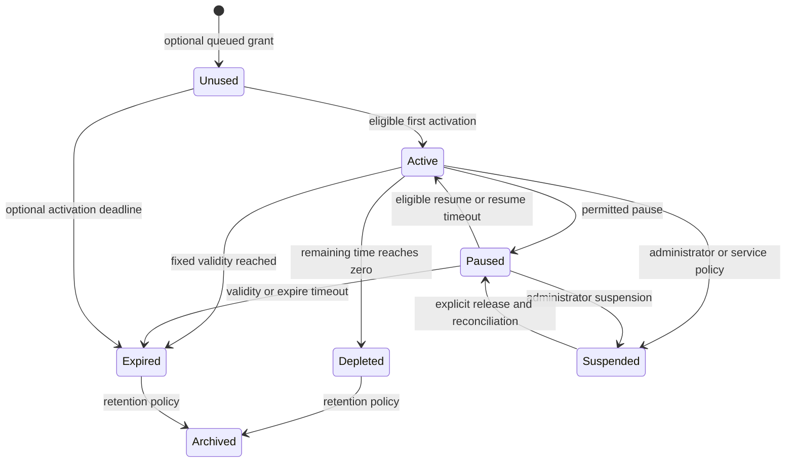

# PisoFi 5.3.0 Time, Validity, Pause, and Session Audit for Eco-Fi

**Audit date:** 2026-09-06, Asia/Taipei

**Scope:** Direct, read-only investigation of the supplied PisoFi disk image and comparison with current Eco-Fi source.

**Implementation status:** Research and proposed design only. No application, firmware, database, network configuration, or image changes were made.

**Detailed migration specification:** [Eco-Fi migration to PisoFi-style time and pause behavior](../plans/ecofi_pisofi_migration_plan.md). This companion provides a concrete preset, pause mathematics and worked examples, storage/transaction design, endpoint/device integration, migration/rollback procedure, and acceptance gates. It selects separate entitlements for the proposed migration; this audit remains the source-evidence baseline.

## 1. Main finding

Eco-Fi can adopt PisoFi's separation of **spendable internet time**, **session validity**, **pause allowance**, **account ownership**, and **current network connection**. This is more useful than copying its PHP daemon or adding another timestamp to Eco-Fi's existing session dictionary.

The previous audit contained material errors:

- `client_sessions` is coin/session bookkeeping, not the primary internet-time balance table.
- `status = 0` means **unused/inactive**; `status = 2` means **paused**.
- Pause-validity timeout reconnects qualifying paused clients and resumes consuming time. It does **not** directly erase their balance.
- The source default for `auto_remove_expired_sessions` is **disabled**.
- Depletion, validity expiry, and cleanup use different paths, not one universal “set status 4, then cron archives it” operation.
- Eco-Fi already has `paused_at` and `expires_at`, but the latter means a **paused-credit forfeiture deadline**, not PisoFi's general validity date.
- PisoFi's wallet is transaction-backed purchasing value; Eco-Fi's wallet stores whole minutes. Full parity is not established.
- The claim that Eco-Fi conclusively solved an original PisoFi “IP ghosting issue” was not supported by a demonstrated original runtime defect.

**Recommended direction:** retain Eco-Fi's bottle rewards and short network authorization leases. Introduce one authoritative lifecycle, explicit validity/pause policies, durable ownership, and atomic credit movements. Offer PisoFi-style automatic resume explicitly, separate from Eco-Fi's current expire-while-paused behavior.

## 2. Evidence, provenance, and limits

### 2.1 Exact image

| Property | Verified value |
|---|---|
| File | `resources/PisoFi_Opi1&PC_v5.3.0-05-10-26_EXT.img` |
| Absolute path | `D:\PROJECTS_IO\Plastic-Bottle-Vending-Machine\resources\PisoFi_Opi1&PC_v5.3.0-05-10-26_EXT.img` |
| Size | 3,162,022,400 bytes |
| SHA-256 | `ba92e26a8c0b2c335562af0069e3de4635a1cc21d0ac4643d172429b517a4aa0` |
| Partition table | MBR; partition 1 type `0x83`; other entries empty |
| Root start | Sector 8,192 using 512-byte sectors |
| Root offset | 4,194,304 bytes |
| Partition length | 6,167,633 sectors |
| Filesystem | ext4 |
| Inspection mount | Loop mount with `ro,noload`; reported `ro,norecovery` |
| Internal version | `5.3.0` |
| Internal release date | `2026-04-17`, from `version.json` |
| Internal description | `Upgrade OS to Buster` |
| Image OS timezone | `/etc/timezone`: `Asia/Taipei`; `/etc/localtime` points to that zone |

Filename and internal release date are separate provenance facts. The application root is:

```text
/.cache/tmp/55/05/pfi/
    app/Models/
    app/Controllers/
    app/Pisofi/
    app/Helpers/
    app/Routes/
    scripts/
    resources/
    version.json
```

The visible `/var/www/html/pisofi/scripts/kicker.php` matches the hidden-root kicker byte-for-byte. The inspected model files are absent from that visible web directory; scripts bootstrap the hidden root. Boot/watchdog wrappers reside under `/home/pi/.dat/devnull/.../`.

### 2.2 Method

1. Read the existing audit and repository status.
2. Read image partition entries and calculate its complete hash.
3. Mount read-only with journal replay disabled.
4. Extract/decode 477 application, script, view, wrapper, and service files into temporary storage outside this repository.
5. Decode hexadecimal/octal PHP string escapes and add layout boundaries outside quoted strings, preserving labels and `goto` instructions.
6. Follow relevant `goto` destinations; textual proximity is not execution order.
7. Trace settings, credit creation, pause callbacks, expiry predicates, archives, boot, and watchdog behavior.
8. Compare with actual Eco-Fi functions/schema declarations.
9. Run ten isolated assertions against selected actual Eco-Fi functions extracted with Python AST, without importing/starting the application.
10. Unmount after inspection operations.

References use image paths, function names, fields, and original labels. Temporary layout-generated line numbers are not permanent citations.

### 2.3 Evidence categories and limitations

| Category | Meaning |
|---|---|
| Image-confirmed | Cited code, predicate, field use, or default exists in the supplied image. |
| Repository-confirmed | Cited behavior exists in current Eco-Fi source. |
| Isolated reproduction | Selected actual functions produced the stated result under controlled in-memory inputs. |
| Static risk | Source permits the failure under stated conditions; no claim it occurred on deployed hardware. |
| Proposal | Recommended future design, not an existing feature. |

Original PHP, MySQL, boot scripts, and network services were **not executed**. No live Orange Pi was contacted. Packet cutoff, timing, recovery latency, and hardware behavior were not measured.

The image contains `.frm`/`.ibd` artifacts for the relevant tables. Descriptions below come from models and SQL, **not a recovered `SHOW CREATE TABLE` dump**. Exact physical types, indexes, constraints, and saved configuration values were not reconstructed by starting a copied database.

Settings called defaults are application defaults. Saved `settings` JSON can override them; they are not asserted to be effective operator settings.

The local firmware dump has `public/` and `scripts/`, not the inspected `app/` tree. Its kicker and pauseconnections match the image after CRLF/LF normalization, though raw hashes differ. Missing backend files were investigated directly from the image.

Eco-Fi baseline commit: `4ab6710222e878c1097fb2c622831115e010a8e9`. The initially untracked, unrelated `pisofi_routes.tar.gz` was left alone. Repository comparison does not establish deployed hardware or the separate Eco-Fi image is identical.

## 3. Corrections to the earlier audit

| Earlier claim | Correction | Primary evidence |
|---|---|---|
| Credit in `client_sessions` or `connection_sessions` | Entitlements in `connection_sessions`; selected connections in `active_clients`; coin bookkeeping in `client_sessions` | Models and kicker joined update |
| Every depleted client becomes status 4 first | Kicker disconnects/archives/deletes depleted clients and linked entitlement without universal status-4 assignment | `XnQio -> IVjD_` |
| Paused is status 0 | Unused is 0; paused is 2 | `ConnectionSession` constants/`getStatus()` |
| Pause pushes expiry forward | Expiry helper rebases unused sessions, not ordinary paused ones | `expirationDate()`, `pauseResponse()` |
| Pause validity erases time | Reconnect and set status 1 | Kicker `GQujK` through `QzB2x` |
| Cleanup default enabled | Default `DENIED`/0 | `SessionOptionsManager` |
| Cron archives internet sessions into `old_client_sessions` | Kicker uses `old_clients`/`old_connection_sessions`; some expiry paths directly delete | Kicker and scheduled cleanup |
| Global TTL identical everywhere | Rate, fallback, promo, admin, and merge paths differ | Purchase/promo/controller code |
| `/account/register` proves captive registration | `AccountController` creates `User`; captive registration creates `ClientAccount` in `ConnectionApiController` | Routes/controllers |
| Membership/wallet parity complete | Units, ledger, ownership, expiry, and migration differ | Both implementations |

## 4. PisoFi's data model

### 4.1 Different records serve different purposes

| Table | Role | Important fields observed |
|---|---|---|
| `client_sessions` | Coin/insertion bookkeeping and account-associated coin collection | `mac`, `ip_address`, `coin`, `desktop_coin`, `current`, `visit`, `last_lockout`, `client_id`, `vendo` |
| `connection_sessions` | Purchased, granted, transferred, or unused internet entitlement | `id`, `connection_time`, `running_time`, `remaining_time`, `expiration_date`, `status`, `type`, `origin`, `client_id`, `allow_pause`, `pause_count`, `last_paused`, speed/data fields |
| `active_clients` | Selected device connection and enforcement state | `session_id`, `mac`, `ip_address`, `mark`, `remaining_time`, `status`, `expiration_date`, pause fields, rates, usage |
| `old_clients` | Archived active-connection snapshots | Identity, remaining time, status, usage, rates, session ID, expiry when applicable |
| `old_connection_sessions` | Archived entitlement snapshots on kicker removal path | Created from linked `ConnectionSession::toArray()` |
| `old_client_sessions` | Separate historical coin/session model | Coin/session fields; not the kicker's linked internet entitlement archive |
| `time_expirations` | Purchased-minute to validity-minute mapping | `value`, `expiration`, `status`, `description` |
| `client_accounts` | Persistent member identity and wallet summary | `client_id`, `passkey`, MAC/IP, `wallet`, account status, remember-token fields |
| `wallet_transactions` | Transaction history used to calculate wallet | Account, type, category, amount, description |

```text
Account or device
    +-- connection_sessions: entitlement A, B, C ...
    |       remaining time + validity + origin + policy
    +-- active_clients.session_id -> selected entitlement
            current IP/MAC + network enforcement state
```

`connection_sessions` is not merely historical. It supports unused/paused purchases, switching, and next-session selection. `connection_time` and `running_time` are stored alongside remaining time; their names must not substitute for the actual debit expression without checking the caller.

### 4.2 Status, type, and origin

| Value | `ConnectionSession` constant | Meaning | Countdown implication |
|---|---|---|---|
| 0 | `STATUS_INACTIVE` | `UNUSED` | Special validity rebase; not ordinary active billing |
| 1 | `STATUS_ACTIVE` | `ACTIVE` | Selected active-client update consumes time |
| 2 | `STATUS_PAUSED` | `PAUSED` | Spendable countdown stops; validity remains separate |
| 3 | `STATUS_DISCONNECTED` | `DISCONNECTED` | Distinct from unused/depleted |
| 4 | `STATUS_EXPIRED` | `EXPIRED` | Expiry state with helper/cleanup caveats below |

`TYPE_SESSION = 1` is time service; `TYPE_DATA_PLANS = 2` is quota service. Origins include coin, WiPass, administrator, live transfer, wallet, time transfer, auto/merged, promo, and free. These distinctions govern merging, pause, conversion, and expiry.

## 5. The different clocks

### 5.1 Spendable internet time

`remaining_time` is seconds. The kicker subtracts elapsed time while the selected connection is active and clamps to zero. This measures purchased access time, not bytes or actual browsing activity. Disconnect-based pause is separate and optional.

### 5.2 Calendar validity

`expiration_date` answers **until when may this entitlement be used?** A session can retain positive seconds but be past its validity date. The date can originate from a time-validity rule, global fallback, promo, administrator, ticket, or merge. It is not necessarily recalculated from remaining balance on each request.

### 5.3 Pause duration

`last_paused` plus configured minutes determines when ordinary paused time automatically resumes. For a pause at 10:00 with a 60-minute allowance and validity tomorrow, credit is preserved until the first eligible kicker pass at/after 11:00, then countdown resumes. Calendar validity remains independent.

### 5.4 Unused-session activation

For status 0, `ConnectionSession::expirationDate()` returns:

```text
validity_duration = difference between created_at and stored expiration_date
activation/display expiry = now + validity_duration
```

`SessionManager` assigns this result to its session in the constructor. Successful connect saves active state. This expresses activation-relative validity for unused sessions, not extension during ordinary pause.

Not every caller honors the same exception: auto-continue SQL compares stored dates directly. Do not promise every unused session can remain dormant indefinitely solely because the model helper rebases its date.

## 6. Kicker: accounting, depletion, and enforcement

**Sources:** `scripts/kicker.php`, `/home/pi/.dat/devnull/.../k`, `/home/pi/.dat/devnull/.../s`.

### 6.1 Timing and singleton behavior

- The wrapper checks MySQL and invokes PHP.
- PHP obtains a nonblocking exclusive `.lock` file lock to avoid concurrent kicker instances.
- The main function contains an internal loop with normal `sleep(3)`.
- The outer wrapper also has `sleep(1)` after function return and `sleep(5)` on its exception path. Neither implies each normal pass takes exactly one or three seconds.
- Normal elapsed is `max(0, current_time - last_kicker_run)`.
- Initialization resets a missing checkpoint, or one more than 60 seconds old, to current time.
- In-loop gaps of at least 1,800 seconds enter clock correction. Success resets the checkpoint and recalculates elapsed; failure can retry without normal debit processing.
- A normal pass stores its captured time as `last_kicker_run` before sleeping.

Useful original label chains:

```text
Initialization: eJPPZ -> h2qeP; PJFjE -> A7Zoz when stale
Time capture:  YV7PU -> qI12E -> KMOxh
Gap guard:     LAVAA -> SIC9P -> bgPQS
Normal finish: jeJKY -> WQfBH -> Tsldv -> JsmFN
```

This is wall-clock accounting with correction rules, not monotonic timing or unconditional billing of all time since the previous process lifetime.

### 6.2 Joined balance update

Structurally, the core update is:

```sql
UPDATE connection_sessions s, active_clients a
SET
    s.status = a.status,
    a.updated_at = NOW(),
    s.remaining_time = IF(elapsed > a.remaining_time, 0,
                          GREATEST(0, a.remaining_time - elapsed)),
    a.remaining_time = IF(elapsed > a.remaining_time, 0,
                          GREATEST(0, a.remaining_time - elapsed)),
    a.expiration_date = s.expiration_date,
    ...
WHERE s.id = a.session_id AND a.status = 1;
```

`elapsed` substitutes for interpolated `$qqyKB`; assignments are omitted for readability. The original also synchronizes rates, usage, pause policies/counts, data quota, and session data. Its expiry CASE sets the active row to 4 when the linked date is no longer greater than `NOW()`.

Both balance assignments visibly derive from `a.remaining_time`. This audit does not assume guaranteed multi-table assignment order or stronger concurrency properties than demonstrated. Eco-Fi should compute a settled balance once and persist it consistently.

Before this update, entitlement rows claiming active state but not selected by an active client are set paused. This reconciles entitlement and connection state.

### 6.3 Removal and archive sequence

The active-client removal query selects active time clients with `remaining_time <= 0`, active data clients with total usage **greater than** quota or nonpositive quota, active-client status 0, and status 4 only when automatic removal is enabled. The data comparison is literally `>`, not `>=`.

For selected clients:

1. Call `Pisofier::disconnect()`.
2. Archive through `archiveClient()` into `old_clients`.
3. Find linked `ConnectionSession`.
4. Copy it to `old_connection_sessions` and delete it.
5. Delete active-client row.
6. Publish disconnection events when applicable.

Time depletion does not depend on auto-remove-expired and does not universally assign status 4 before archiving.

### 6.4 Expiry/enforcement caveats

The joined calendar check processes active status-1 rows. Paused dates are handled through API/helper validation and optional direct expiry deletion, among other paths.

With auto-remove disabled, status 4 is absent from the immediate disconnect query. A database status assignment is not an iptables operation. Static evidence does not justify promising unconditional instantaneous packet cutoff for every validity-expiry path. Original packet tests with auto-remove on and off remain necessary.

Eco-Fi should enforce expiry independently of cleanup retention. Do not duplicate an ambiguous dependency between deleting a record and revoking access.

### 6.5 Watchdog

The inspector's `check_frozen_time()` finds status-1 clients with `updated_at` more than 60 seconds stale and restarts kicker and cron. The inspector sleeps 60 seconds and checks service health. Detection latency combines threshold, cadence, and work duration.

The useful pattern is a billing-worker heartbeat, not merely checking that the web process lives.

## 7. Where PisoFi validity comes from

### 7.1 Source defaults

`SessionOptionsManager` merges saved `settings.session_settings` with:

| Setting | Default | Meaning |
|---|---:|---|
| `session_expiration_enabled` | 1 | Global fallback expiry enabled |
| `session_expiration` | 1440 | Minutes |
| `auto_remove_expired_sessions` | 0 | Optional expiry removal disabled |
| `pause_enabled` | 1 | Default entitlement pause permission |
| `auto_continue` | 1 | Next eligible entitlement selection |
| `enable_session_switching` | 1 | Switching, subject to other checks |
| `auto_merge_all_sessions` | 0 | No universal merge by default |
| Per-origin auto-merge flags | 0 | Separate cash, wallet, WiPass, admin, transfer, and data switches |

### 7.2 Configured time-to-validity brackets

`TimeExpiration::calculateExpiration($time)`:

```php
$expiration = self::where('value', '>=', $time)
    ->orderBy('value', 'asc')->first();
if (!$expiration) {
    return null;
}
return $expiration->expiration;
```

Input and returned validity are **minutes** in examined callers. Coin/wallet paths pass `intval($time / 60)` where purchased `$time` is seconds. This selects the smallest upper-bound threshold covering the purchase, not exact match, interpolation, or Eco-Fi's square-root formula.

Illustrative configuration, **not recovered database rows**:

| Purchased-minute ceiling (`value`) | Validity minutes (`expiration`) |
|---:|---:|
| 60 | 1440 |
| 180 | 4320 |
| 1440 | 10080 |

Here 40 minutes selects 60; 75 selects 180; 2,000 has no match and falls back through caller logic.

**Original caveat:** the method does not filter by `status`, despite that field existing. Eco-Fi should ignore disabled rules and validate thresholds. Returned zero is false in examined callers, triggering fallback rather than expressing a zero-duration deadline.

### 7.3 Coin/wallet fallback

Examined ordinary Wi-Fi purchase branches in `PisofiServerEventHandler` and `WalletController` use:

```text
if a truthy time-validity rule matches:
    expiry = now + rule validity minutes
else if global expiration enabled:
    expiry = now + max(global validity minutes * 60, purchased seconds)
else:
    expiry = null
```

A 30-hour purchase can receive at least 30 hours despite the 24-hour fallback. A matched bracket is used directly; that branch does not visibly apply the same purchased-duration floor. This is a purchase-path finding, not a universal promo/ticket/admin/extension formula.

### 7.4 Promo packages

`PromoPackage::getExpirationInMinutes()` converts hours × 60, days × 1,440, months × 43,200, otherwise leaves minutes unchanged. “Months” means fixed 30-day blocks, not calendar months. `getExpirationDate()` adds positive converted validity to now, otherwise returns null.

Recurrence/schedule duration is another concept. Eco-Fi's current `promo_rates` has bottles, minutes, label, and speed profile, but no per-promo validity policy.

### 7.5 Administrator and merge formulas

`ConnectionSessionController` accepts explicit `expiration_date` or relative expiry minutes. Examined administrator merge branches handle:

| Existing date | Incoming date | Resulting formula |
|---|---|---|
| Present | Present | Old date plus incoming interval from now |
| Absent | Present | Incoming date plus old remaining seconds |
| Present | Absent | Old date plus incoming purchased seconds |
| Absent | Absent | Null |

Cash auto-merge differs: with an existing date it can add matched rule duration, applicable global/purchased duration, or purchased seconds. An undated active session can remain undated in that branch. Origin/type changes can create a new auto session with separately computed validity.

`ConnectionSession::mergeSessions()` has another rule: sum other remaining balances into the survivor and add those seconds to its existing expiry, if any. Delete merged-away rows. Their independent deadlines are not retained.

**Lesson:** adding time and extending validity are separate operations. There is no universal PisoFi top-up formula for all Eco-Fi endpoints.

### 7.6 Helper and equality quirks

`ConnectionSession::isExpired()` first returns false for no date, then false for status 0, before:

```php
$expiration = Carbon::parse($this->expiration_date)->format('U');
$now = time();
return ($expiration < $now) || $this->status === 4;
```

`ActiveClient::isExpired()` also returns false early for no date, but lacks the unused exception. A no-date status-4 row can therefore return false from the helper. Strict integer comparison merits runtime hydration verification; other callers check status separately.

Equality varies: model `< now`, active update requiring `date > NOW()`, other selection using `>=`, deletion using `<`. Choose one Eco-Fi convention, preferably `now >= deadline`, and enforce it everywhere.

## 8. Pause policy: actual behavior

### 8.1 Portal defaults

| Setting | Default | Meaning |
|---|---:|---|
| `portal_allow_pause` | Allowed | Pause feature |
| `portal_allow_pause_validity` | Allowed | Auto-resume timer |
| `portal_pause_validity` | 60 | Minutes since pause |
| `max_pause_limit` | 3 | User pause count; nonpositive means unlimited in checked paths |
| `portal_enable_min_pause_time` | Denied | Minimum-credit restriction off |
| `portal_min_time_allow_pause` | 0 | Remaining minutes eligible for pausing |
| `portal_enable_max_pause_time` | Denied | Maximum-credit restriction off |
| `portal_max_time_allow_pause` | 90 | Remaining minutes eligible for pausing |

Minimum/maximum pause time here means **remaining balance eligible for pause**, not how long the client may remain paused.

### 8.2 Normal transition

`SessionManager::pauseResponse()` sets both records status 2, increments user-context pause count, copies policy/count, stamps both `last_paused` values, and saves. It does not extend validity. Connect/reconnect response paths set active status and clear `last_paused`.

`ConnectionApiController::manageSession()` rejects expired sessions and rejects a new pause when `pause_count >= max_pause_limit` for a positive limit. Portal eligibility additionally combines global/session permission, remaining-time range, non-data type, and count. Backend enforcement must be checked per endpoint; UI availability alone is not proof of universal enforcement.

### 8.3 Pause-validity timeout: decisive evidence

When enabled, the kicker appends:

```sql
status = 2
AND type = 1
AND admin_pause_override = 0
AND last_paused IS NOT NULL
AND TIMESTAMPDIFF(MINUTE, last_paused, NOW()) >= pause_validity_minutes
```

Matching active clients are reconnected and set active:

```text
GQujK: append timeout predicate
   ...
EY725: select ActiveClient rows using OR-combined predicates
K6Z30: check count
QzB2x: loop matches
AhYlb: call connect()
hZ2Qq: set status = 1
EHFR9: save()
```

No balance-zeroing occurs in this loop. Later processing resumes deductions and synchronizes the linked session. This uses direct reconnect/status updates, not the full normal resume callback, so it does not immediately perform every callback action such as clearing `last_paused`.

### 8.4 Other forced-resume conditions

Enabled minimum/maximum-credit restrictions also reconnect qualifying paused time clients, excluding admin override. The appended excessive-count predicate is literally `pause_count > max_pause_limit`; it does not repeat the timeout predicate's status/type/admin filters. This differs from API rejection at `>=`.

A separate query selects `(paused AND no admin override AND allow_pause = 0) OR type = 2`. Its broad data-plan clause is another reason not to translate the SQL mechanically.

### 8.5 Calendar validity while paused

The existing date continues approaching while spendable credit is preserved. Model/API checks can reject expired use; optional cleanup can delete expired entitlements. There is no confirmed universal “every paused row becomes expired next kicker pass regardless of settings” rule. With cleanup off, stale records can remain and must still be denied at use time.

### 8.6 Network disconnect and boot policies

`NetworkManager` source defaults:

| Setting | Default |
|---|---:|
| `auto_pause_wifi` | 0 |
| `auto_pause_desktop` | 0 |
| `auto_pause_charging` | 0 |
| `auto_resume_when_connected` | 1 |
| `auto_pause_when_disconnected` | 0 |

The inspector uses ARP when disconnect pause is enabled. It changes both records' statuses, pause counts, and timestamps. Its reconnect SQL can make ARP-present paused clients active without distinguishing all pause reasons.

ARP presence is not proof of human browsing. A broad “any paused client seen in ARP resumes” rule would conflict with explicit user/admin pauses in Eco-Fi.

## 9. Boot and clock recovery

Startup invokes `pauseconnections.php` and resets `last_kicker_run` to `unix_timestamp()`, avoiding a simple debit of all powered-off time.

`pauseconnections.php` is conditional:

- Wi-Fi auto-pause enabled: positive-balance active time clients become paused, receive `last_paused`, and `admin_pause_override = 1`.
- Disabled and boot state reports internet: qualifying positive-balance paused active rows can become active and rules are rebuilt.
- Desktop and charging have separate handling.

“Always pauses everyone on reboot” is incorrect. Source Wi-Fi auto-pause default is off.

`PisofiHelper::setDateTime()` obtains external time, sets configured timezone/system date, changes kicker service state, and calls pauseconnections in a successful path. The inspected code includes an HTTP time-service request. None was executed during this audit.

Eco-Fi must decide separately:

1. Does spendable time stop during host outage? Recommended: yes unless an explicit continuous-time product says otherwise.
2. Does fixed validity continue? Recommended: yes for fixed-validity products, evaluated with a trustworthy clock.
3. Do user/admin pauses survive reboot? Recommended: preserve reason and original applicable deadline.
4. What if boot clock is implausible? Preserve value; avoid destructive expiry until trusted-time reconciliation.
5. Is outage compensation allowed? Record an explicit adjustment instead of silently changing expiry policy.

## 10. Cleanup, archives, and auto-continue

| Path | Selection | Action |
|---|---|---|
| Kicker depletion/removal | Depleted active time, exceeded data, status 0, optional status 4 | Disconnect; archive active/linked entitlement; delete live rows |
| Kicker direct expiry purge | `status = 4 OR (date < NOW() AND status <> 0)` with auto-remove enabled | Direct delete from `connection_sessions`; statement does not archive each row |
| Kicker orphan cleanup | Missing/null linked session or empty MAC | Disconnect/archive/delete invalid active row |
| Scheduled session cleanup | Nonpositive coin and desktop coin | Delete empty `VendoSession`/`ClientSession` |

Direct expiry deletion is not a complete ledger. Eco-Fi should record why credit disappeared independently of operational row retention.

When auto-continue is enabled, kicker searches for a minimum-ID eligible entitlement for a MAC/IP pair without an active-client record and calls `SessionManager(..., 'connect')`. It requires a nonempty MAC and uses stored-date CASE expressions to exclude expired candidates.

This is package selection, not summing all purchases. Earliest-expiring eligible credit may be preferable in Eco-Fi, but is a deliberate policy difference. Resolve unused activation behavior explicitly rather than inheriting the helper/SQL mismatch.

## 11. Membership, wallet units, and device movement

`ClientAccount` uses nonincrementing `client_id` as primary key. Its `passkey` uses PHP password hashing/verification through model helpers, adding an application salt. The embedded value is unnecessary for this design and is not reproduced.

`ConnectionApiController::register()` obtains request IP/MAC, creates `ClientAccount`, establishes session identity, and associates related records. `AccountController::registerAccount()` instead creates `User`; these are different flows.

### 11.1 Wallet is purchasing value

- `addWalletTransaction()` records type/category/amount transactions.
- `updateWalletAccount()` and `updateAllAccountWallets()` sum signed transaction amounts.
- `WalletController` converts wallet amount through rates into Wi-Fi time.
- The purchase creates/extends sessions with validity and pause policy.

Eco-Fi directly converts `wallet_minutes` into seconds. A purchasing-value wallet buys a product at rates; a stored-time wallet should preserve exact time and, if required, original validity. Conflating them can change old credit's value or remove restrictions.

### 11.2 Account movement

The inspected sign-in path tracks prior-device logout information, removes old active records for the account, pauses/rebinds account entitlements, updates tickets/transfers/coin records, and optionally merges origins.

The moved object is richer than “old IP has N minutes”: it has ownership, entitlement records, origin, policy, and connection state. This proves intended cross-device support, not a verified original “ghost IP” defect or its resolution.

## 12. Current Eco-Fi implementation

Sources: [portal.py](../host/portal.py), [gateway_network.py](../host/gateway_network.py), [ecofi.service](../host/ecofi.service).

### 12.1 Live memory and SQLite snapshot

Live state is an IP-keyed `active_clients` dictionary with an `RLock` around many operations. `active_sessions` persists:

```text
ip, mac, remaining_seconds, is_paused,
dl_kbps, ul_kbps, pending_bottles,
paused_at, expires_at, saved_at, state_json, member_username
```

Extra JSON flags include `user_paused`, `auto_paused`, and `admin_paused`. There are no equivalent independent unused entitlement records or general validity date.

| Table | Value semantics | Validity capability |
|---|---|---|
| `promo_rates` | Bottle threshold to minutes/speed | No per-rate calendar validity |
| `vouchers` | Redeemable whole-minute code | No general unused-code expiry column |
| `time_transfers` | Seconds represented by claim code | Creation time, but no enforced expiry in current claim path |
| `members` | Whole-minute wallet | No per-credit validity/provenance |
| `active_sessions` | Aggregate IP-associated snapshot | `expires_at` used for paused-credit expiration |

### 12.2 Existing dynamic pause formula

`calculate_pause_validity_seconds()`:

```text
M = remaining_seconds / 60
H = clamp(12 + 1.2 * sqrt(M) + 0.025 * M, 24, 720)
validity_seconds = floor(H * 3600)
```

Nonpositive balances return zero; positive balances receive 24 hours to 30 days. Actual calculated examples:

| Remaining credit | Pause validity seconds | Approximate duration |
|---:|---:|---|
| 10 minutes | 86,400 | 24 hours |
| 40 minutes | 86,400 | 24 hours |
| 75 minutes | 87,362 | 24 h 16 min |
| 180 minutes | 117,358 | 32 h 36 min |
| 1,440 minutes | 336,732 | 3 d 21 h 32 min |
| 10,080 minutes | 1,384,124 | 16 d 29 min |

`compute_session_expiration()` adds this duration to pause time. It uses **remaining balance at pause**, unlike examined PisoFi purchase-time bracket selection.

### 12.3 Countdown, save, and restore

`time_daemon()` uses wall clock. It charges one second on first tick, backward movement, or gaps over ten seconds; otherwise at least one rounded elapsed second. It saves every 30 iterations, checks ARP policy every 60, refreshes paid access every ten, revokes depletion, and sleeps one second.

Iterations are not strict elapsed schedules. Slow operations extend intervals. A stall over ten seconds is billed as one second; per-tick rounding can drift.

`save_sessions_to_db()` deletes/rebuilds the snapshot in a connection transaction. It skips depleted/unpaused/no-pending entries and `saved:` identities, and does not archive removed sessions.

Restore loads state, converts pending bottles into time, checks paused expiry, and synchronizes access. It does not select/use `saved_at` to subtract offline time. Saved active balances can resume without charging host downtime.

### 12.4 Useful short authorization leases

`gateway_network.grant()` validates IP/MAC, applies shaping, then grants IP and IP/MAC membership for `max(1, min(30, int(seconds)))`. `revoke()` removes authorization and tracked shaping. Portal synchronization evaluates license, MAC block/free policy, remaining credit, and pause state.

Preserve these leases. A future fixed deadline should also cap them. They are a network fallback, not a durable ledger or complete protection against other code refreshing stale balances when billing stops.

### 12.5 UI meaning

`api_vendo_status()` returns actual pause `expires_at` when paused. While active, it can generate `expires_str` from **what the pause deadline would be if paused now**. That projection is not a stored active validity deadline.

Display browsing depletion estimate, fixed validity, and pause allowance/action separately. Generic “Expires” is ambiguous.

## 13. Eco-Fi risks relevant to this migration

These are findings to address before adding more expiry policies. They do not authorize implementation during this audit.

### 13.1 Repeated pause renews an overdue deadline — reproduced

`api_client_pause()` assigns new pause/deadline values without settling an existing overdue paused session first. For an existing same-IP/MAC paused record, `ensure_client_session()` can return it without calling `session_expired()`.

At isolated `now = 1000`, old deadline `999`, balance 600 seconds, repeating `pause` preserved 600 seconds and changed the deadline to `87400`. Explicit `resume` on identical initial state correctly rejected and zeroed the credit.

**Required:** expire first; repeating an existing pause must not renew it unless an explicit extension is purchased/applied.

### 13.2 Clearing pause before settlement can revive old credit — static risk

Bottle completion, voucher redemption, transfer claim, and wallet use add seconds then clear pause/deadline fields before synchronization. If the daemon has not cleared an overdue paused record, this ordering can carry old expired seconds into new credit.

Affected functions: `api_vendo_done`, `api_voucher_redeem`, `api_transfer_claim`, `api_member_use_wallet`.

**Required:** settle old eligibility first, then create new credit with its own policy. A bottle/voucher must not silently restore forfeited time.

### 13.3 Wallet/transfer movements lose expiry restrictions — static risk

`api_member_save_time()` and `api_transfer_generate()` read available credit before general expiry settlement. Transfers do not retain source deadlines; wallets store only minutes. Even valid moved credit can lose restrictions unless this is a deliberate conversion product.

**Required:** preserve source validity or explicitly record the operator-approved conversion policy.

### 13.4 Member login can migrate overdue or misassociated credit — static risk

`api_member_login()` adds old positive balances without settling old deadlines. Its database fallback selects balance, speeds, and pause boolean, omitting expiry, pause timestamp, and full state.

It considers saved `active_ip`; an IP reassigned to another device is not proof of ownership. Source credit needs durable account/session identity verification.

**Required:** load complete policy/ownership, settle before migration, revoke old access, carry eligible metadata, and commit one ownership movement.

### 13.5 Administrator pause is not independently enforced everywhere — static risk

Explicit user resume rejects `admin_paused`, but `sync_client_firewall()` checks paid balance and `is_paused`, not an independent administrator exclusion. Top-up/migration can clear `is_paused` while leaving the admin flag. Admin pause also does not consistently initialize a deadline.

**Required:** one eligibility decision must respect administrator suspension across purchases, resume, login, transfer, restore, and auto-resume.

### 13.6 Credit movements are not one durable transaction — source-confirmed structure

`atomic_credit_change()` returns the function unchanged; it adds no transaction behavior. Separate durable steps include:

- Voucher/transfer claim consumes a code before session credit persistence.
- Wallet use commits wallet debit before session credit persistence.
- Transfer generation reduces/saves balance before inserting the code.
- Wallet saving clears/saves the session before wallet increment commits.

A crash/error between steps can lose value. Conditional updates prevent some double claims but do not atomically commit both sides. Independent nested connections and lock ordering also need review.

**Required:** one SQLite transaction for debit, credit, operation ID, and history; network reconciliation follows commit with retries.

### 13.7 Wallet conversion loses remainder — source-confirmed

Wallet saving divides seconds by 60 and then clears all session seconds. Saving 125 seconds stores two minutes and loses five seconds.

**Required:** store seconds, or explicitly preserve/document the remainder.

### 13.8 IP-reuse holding state is not durable — static risk

`ensure_client_session()` can move old credit to `active_clients['saved:' + mac]`. Persistence skips `saved:` keys. Restart can lose held credit; such entries can also remain active-looking to the daemon unless state is settled explicitly.

**Required:** durable credit ownership independent of routable IP; unbound credit must not become an active network connection.

### 13.9 Admin actions delete the row after saving — source-confirmed

`admin_api_client_action()` saves sessions then unconditionally deletes that IP's snapshot row for handled add-time/pause/resume actions as well as kick. Memory can repopulate it later, but an intervening crash can lose the adjusted record.

**Required:** delete only for intended removal; persist adjustments and state changes durably.

### 13.10 Pending bottle finalization can credit twice — static risk

UART credit increments `pending_bottles`. Completion credits simulator session bottles and saves without visibly clearing the session dictionary's pending count. Restore converts pending bottles into seconds. Together these permit a possible double-credit path after completion/restart.

No hardware sequence was executed; an end-to-end reproduction remains required. **Required design:** durable event/deposit IDs and atomic one-time pending-event finalization.

### 13.11 Web-process health does not prove billing-worker health

Billing is a daemon thread started by `__main__`. The service restarts a failed process, but no inspected heartbeat supervises that thread specifically. A worker exception can leave the web process alive.

`ensure_client_session()` can synchronize positive unpaused credit, potentially refreshing stale authorization through requests if billing stops. **Required:** settle elapsed at grant boundaries or require healthy accounting, plus worker supervision. A short lease alone is insufficient for this case.

## 14. What to copy, adapt, and deliberately change

| Capability | PisoFi pattern | Eco-Fi recommendation |
|---|---|---|
| Time unit | Seconds | Integer seconds across session/wallet/transfer |
| Calendar validity | Per-entitlement date | Dedicated field separate from pause deadline |
| Pause timeout | Reconnect and consume time | Explicit configurable policy, distinct from forfeiture |
| Validity pricing | Time upper-bound rule table | Validated configurable reward-to-validity table |
| Unused purchases | Distinct unused entitlement | Add if queued activation is needed; explicit activation timestamp |
| Active connection | Separate row selecting entitlement | Separate ownership/balance from IP and lease |
| Merging | Per-origin configuration | Compatible-only merging or separate grants |
| History | Mixed archive/direct deletion | Record every value-changing event and expiry reason |
| Device migration | Account-associated entitlements | Move full eligible state, not arbitrary IP balance |
| Resilience | Kicker and inspector | Worker heartbeat/reconciliation; retain short leases |
| Clock | Wall clock with correction | Monotonic elapsed plus trusted UTC deadlines |
| Enforcement | Several SQL/network paths | One eligibility function for every grant/restore/resume |

Do not copy obfuscation, broad SQL predicates, helper early-return quirks, inconsistent equality boundaries, deletion without reason, or assumptions that database and firewall mutations are atomic together.

## 15. Proposed Eco-Fi model

The [detailed migration specification](../plans/ecofi_pisofi_migration_plan.md) now selects separate entitlements and defines the implementation contract. The alternatives below preserve the earlier design analysis; use the specification for selected defaults, deliberate differences from PisoFi, and full mathematics.

### 15.1 Explicit fields and meanings

These names are proposals, not schema edits:

| Concept | Suggested field | Meaning |
|---|---|---|
| Spendable balance | `remaining_seconds` | Eligible seconds not yet spent |
| Fixed validity | `valid_until_utc` | Credit unusable at/past this date |
| First activation | `activated_at_utc` | Start of activation-relative validity |
| Unused activation limit | `activate_before_utc` | Optional deadline to first activate |
| Pause start | `paused_at_utc` | Actual pause transition time |
| Pause allowance end | `pause_deadline_utc` | When timeout action applies |
| Pause reason | `pause_reason` | User, disconnect, administrator, boot, service outage |
| Pause count | `pause_count` | Counted transitions, not repeated requests |
| Timeout behavior | `pause_timeout_action` | `resume`, `expire`, or `none` |
| Provenance | `policy_id`, `policy_version`, `origin` | Rules producing this credit |

Use null for no deadline rather than overloading zero. Keep fixed validity independent of remaining balance and pause validity.

### 15.2 Two adoption scopes

**Scope A: consistent aggregate sessions.** Keep one balance per durable member/device identity. Add independent fixed validity/pause policy, central transitions, atomic value movements, and history. This covers practical expiry improvements without immediately implementing a package queue.

**Scope B: separate entitlements.** Preserve multiple grants/packages per owner, each with balance, validity, origin, and speed. A connection selects eligible credit. This is closer to PisoFi and better for mixed-validity promos, queued vouchers, and account balances containing different products.

First repair accounting/ownership. Choose A if products intentionally share one policy; choose B before introducing mixed-validity products. A later migration cannot reconstruct provenance already flattened into one balance.

### 15.3 Proposed state machine



This is proposed Eco-Fi behavior, not a literal diagram of all original branches. New top-up creates eligible credit; it must not revive forfeited old grants by clearing a boolean.

### 15.4 One authoritative transition sequence

Every credit/connection operation should conceptually:

1. Identify the durable owner/session and validate authorization.
2. Load complete state under appropriate transaction/lock.
3. Capture trusted UTC time and monotonic elapsed checkpoint.
4. Settle billable elapsed time exactly once.
5. Apply fixed validity and activation limits.
6. Apply pause deadlines and administrator/service restrictions.
7. Validate requested operation against settled state.
8. Atomically record debit/credit, metadata-preserving movement, resulting state, and operation ID.
9. Commit.
10. Reconcile firewall/shaping to committed desired state.
11. Return authoritative state and enforcement errors.

Charge only eligible intervals before a deadline. If an auto-resume deadline falls between ticks, decide how the post-deadline interval is billed; do not charge the entire pause. If service was unavailable due to host failure, apply the separately defined outage policy.

### 15.5 Clock and durability

- Use monotonic elapsed within a process/boot for browsing countdown.
- Preserve fractional elapsed remainder to avoid repeated rounding drift.
- Persist UTC calendar timestamps and display configured local time.
- Never subtract a persisted monotonic reading across reboot without a valid boot/process identity.
- Maintain last trustworthy UTC reference and clock-health state.
- Large forward/backward clock jumps trigger reconciliation, not arbitrary mass deletion or renewal.
- Record outage compensation explicitly.
- Keep one accounting writer or enforce versioned/transactional updates; adding workers to the current process-local dictionary cannot create shared authoritative state.
- Index future owner/session lookups and due deadlines according to the chosen schema; avoid sweeping/deleting/reinserting all value records as the only persistence mechanism.

### 15.6 Network lease

Conceptually:

```text
eligible = license permits service
           AND owner/device not blocked
           AND administrator/service policy permits access
           AND selected credit valid
           AND remaining_seconds > 0
           AND connection active

lease = min(30 seconds,
            remaining eligible browsing seconds,
            seconds until fixed validity deadline if present)
```

Revoke when ineligible. Check eligibility before clamping a lease to at least one second, so an expired grant cannot receive an accidental last lease. Free/whitelisted access needs its own explicit policy rather than scattered exceptions.

Database commit and firewall operations cannot be one SQLite transaction. Persist desired state, apply it, record/retry failures, and reconcile at startup and periodically. Preserve short leases as a fail-safe.

### 15.7 Top-up and merge choices

Prefer separate grants when validity, speed, origin, or conversion restrictions differ. For intentional aggregation, define every combination:

| Question | Recommended starting rule |
|---|---|
| Revive expired credit with new purchase? | No |
| Clear administrator pause on top-up? | No |
| Add compatible nonexpiring credit? | Yes, atomically |
| Flatten dated and undated credit? | Prefer no; otherwise explicitly define/disclose resulting date |
| Reset pause count? | Only for a genuinely new entitlement with a new allowance |
| Extend old validity? | Only through named policy and recorded event |
| Consumption order for multiple grants? | Prefer earliest-expiring eligible credit, subject to speed/product selection |
| Edit existing grants when promo changes? | No by default; snapshot policy at earning time |

### 15.8 Pause modes and user wording

| Mode | At deadline | Portal wording |
|---|---|---|
| PisoFi-style resume | Re-evaluate, then resume eligible countdown | “Automatically resumes at …” |
| Eco-Fi-style forfeiture | Expire intended paused credit and record reason | “Paused credit expires at …” |
| Unlimited pause | No pause deadline; fixed validity may remain | “Paused; valid until …” or no validity deadline |

Changing existing customers between resume and forfeiture is a visible policy change. Do not make it an incidental migration side effect.

## 16. Bottle rewards, wallets, transfers, and history

### 16.1 Bottle reward lifecycle

```text
Validated bottle event
    -> durable pending deposit event
    -> finalized reward grant, once
    -> browsing or stored member credit
    -> consumption / movement / expiry
    -> history
```

Retain deposit/event ID, bottle count, calculated seconds, promo/policy version, and owner. Repeated UART/API delivery must not create a second reward. Restored pending events must be distinguishable from finalized ones.

Separate these calculations:

```text
bottles -> earned seconds       (pricing/reward rule)
grant + policy -> validity date (validity rule)
pause transition -> deadline   (pause rule)
```

A future bracket table could use earned minutes like PisoFi, or bottle count. Declare the key. Selecting validity from accumulated balance instead of the new deposit produces different results for repeated purchases.

### 16.2 Member stored time

Recommended: store grants preserving source validity when moved into/out of a time wallet. If wallet time is intentionally permanent, conversion into it must be an explicit product/policy rather than accidental deadline removal.

Use seconds internally and display minutes/hours without discarding remainders. Login binds ownership/eligible sessions; it must not merge arbitrary records found at a remembered IP.

### 16.3 Transfers

Retain source grant references or equivalent policy metadata, debit event, exact seconds, optional claim expiry, recipient/claim event, and operation state. Code expiry and underlying credit validity are different.

Define unclaimed expiry: return still-valid credit, retain for recovery, or forfeit explicitly. A six-digit code alone is not an accounting record. Collision handling and duplicate retries must not lose the original debit.

### 16.4 History

Useful reasons: `bottle_reward`, `voucher_redeemed`, `wallet_debit`, `wallet_credit`, `transfer_created`, `transfer_claimed`, `time_consumed`, `validity_expired`, `pause_timeout_resumed`, `pause_timeout_expired`, `admin_adjustment`, `device_rebound`, `outage_compensation`.

Retain exact amount, owner/grant, operation ID, timestamp, before/after or linked balances, and reason. Operational cleanup may delete inactive rows without erasing the explanation for value movement.

## 17. Proposed implementation sequence — not performed

Use the [complete migration plan](../plans/ecofi_pisofi_migration_plan.md): sections 3–5 explain pause calculations, 7–9 specify storage/state/network behavior, and 13–15 cover migration, implementation batches, and acceptance tests. The phases below remain an overview.

### Phase 1: Repair present accounting boundaries

1. Centralize settlement and access eligibility.
2. Make repeated pause idempotent and administrator suspension universal.
3. Make voucher/wallet/transfer/bottle finalization atomic and retry-safe.
4. Persist ownership independently of IP and `saved:` memory keys.
5. Resolve admin snapshot deletion and pending-bottle finalization.
6. Add billing-worker heartbeat and reconciliation.

These precede extra policy columns; otherwise added validity creates more ways for state and value to diverge.

### Phase 2: Add explicit policy storage

Choose aggregate or grant-based scope. Add fixed validity, pause deadline/action, activation, durable owner/session ID, policy version, and event history.

Treat existing `expires_at` as **legacy pause expiration**, not `valid_until_utc`. Automatically renaming it would impose a different meaning on customer credit.

### Phase 3: Integrate all paths

| Current touchpoint | Required integration |
|---|---|
| Bottle pricing/UART/completion | Price reward, finalize once, attach policy |
| `time_daemon` | Settle, process deadlines, reconcile, report heartbeat |
| `session_expired` / `resume_session` / pause endpoint | One consistent transition service |
| Snapshot/restore/`ensure_client_session` | Preserve ownership and complete policy across reboot/IP changes |
| Voucher redemption | Consume code and create credit in one transaction |
| Transfer generate/claim | Preserve policy and atomic value movement |
| Member login/save/use | Validate source ownership, preserve seconds and eligibility |
| Admin add/edit/pause/resume/kick | Explicit adjustment/suspension, no incidental revival/deletion |
| Firewall sync/grant | Committed eligible state and deadline-limited lease |
| Portal status/UI | Separate balance, validity, pause action/date, enforcement error |

### Phase 4: Migration and rollback

- Back up database and application version together before future migration.
- Inventory active, paused, overdue, member-bound, pending, and conflicting-IP records.
- Preserve eligible seconds; do not invent purchase dates or original validity missing from old data.
- Assign a documented legacy policy retaining existing pause meaning.
- Handle missing/invalid JSON, zero deadlines, and uncertain ownership explicitly.
- Reconcile overdue records using trusted time before granting.
- Prevent old and new writers from mutating the same value concurrently.
- Report eligible source seconds, migrated seconds, explicit forfeiture/compensation, wallet value, transfer escrow, and pending deposits.
- Ensure rollback understands actual schema/value changes; old binaries may not understand separate grants.

Migration cannot reconstruct previously discarded remainders, missing provenance, or lost ownership. Those require an explicit legacy policy or operator review.

### Phase 5: Controlled rollout

Apply new rules to newly earned credit by default. Test isolated persistence/transition logic, then a controlled gateway, before production. No code patch, migration, deployment, or live policy change was performed for this document-only task.

## 18. Validation and acceptance tests

### 18.1 Performed

Ten assertions passed against selected actual Eco-Fi functions extracted by AST:

| Check | Result |
|---|---|
| Zero balance has zero pause validity | Passed |
| Ten-minute balance gets 24-hour floor | Passed |
| Very large balance capped at 30 days | Passed |
| Paused helper expires at exact deadline | Passed |
| Helper expiry zeros seconds | Passed |
| Active session ignores `expires_at` in helper | Confirmed |
| Repeat pause preserves overdue 600-second balance | Reproduced current defect |
| Repeat pause sets deadline 87,400 at now 1,000 | Reproduced current defect |
| Explicit resume rejects identical overdue state | Passed |
| Explicit resume clears that credit | Passed |

Decorators were removed only in memory; clock, requests, serialization, persistence, and networking were controlled/stubbed. No application import/start, real database mutation, or network grant occurred. No test code was saved into application source. These are not live Flask/SQLite/hardware results.

Image identity/offset/version, selected source hashes, database artifact names, visible/hidden kicker equality, and old-dump newline-normalized equivalence were also checked.

### 18.2 Future acceptance matrix

| Area | Scenario | Required result |
|---|---|---|
| Countdown | Active 600 seconds runs 10 measured seconds | Debit eligible elapsed once |
| Countdown | Paused for 10 seconds | No browsing debit during pause |
| Countdown | Browser closes | Backend accounting follows connection policy |
| Countdown | Worker delayed 20 seconds | Explicit elapsed/outage rule, not unexplained one-second charge |
| Countdown | Worker dies while web lives | Stale balance cannot renew access indefinitely |
| Clock | Backward step | No negative debit or revival |
| Clock | Large forward step | Trusted-clock reconciliation and recorded policy outcome |
| Boundary | Now equals validity date | API/worker/network all reject consistently |
| Boundary | No deadline | Separate from expired/depleted state |
| Pause | Duplicate pause request | No renewed deadline or extra count |
| Pause | Count reaches maximum | Backend/UI consistently reject next pause |
| Pause | Credit equals min/max limit | Defined inclusive boundaries |
| Pause | Resume-mode timeout | Resume eligible credit, do not zero it |
| Pause | Expire-mode timeout | Expire intended credit, record, revoke |
| Pause | Fixed validity precedes pause timeout | Later timeout cannot revive credit |
| Pause | Top-up while admin suspended | Credit handled; access remains suspended |
| Pause | ARP return after user pause | Does not override user intention without explicit policy |
| Top-up | Overdue paused balance gets one bottle | Old expired credit stays expired; new grant survives |
| Top-up | Mixed validity/speed | Preserve grants or documented merge rule |
| Wallet | Save 125 seconds | Preserve all seconds or remainder explicitly |
| Wallet | Concurrent withdrawals exceed total | Cannot spend beyond eligible balance |
| Wallet | Crash between debit and credit | Both sides commit or neither does |
| Transfer | Two simultaneous claims | One value event |
| Transfer | Creation code collision | No lost debit; safe retry |
| Transfer | Source expires while unclaimed | Claim honors source validity |
| Voucher | Crash after consume marker | Recover without loss/double redemption |
| Member | Remembered IP belongs to another account/MAC | No unrelated balance migration |
| Member | Old paused source overdue at login | Settle source before movement |
| Member | Concurrent logins | Durable ownership/connection policy enforced |
| IP movement | DHCP changes address | Credit and deadlines survive |
| IP movement | Old owner has no address | Durable credit without routable key |
| Reboot | Active session, ten-minute outage | Apply downtime and calendar rules independently |
| Reboot | User/admin pause | Preserve reason/original deadline |
| Reboot | Implausible clock | Preserve value pending trusted reconciliation |
| Bottle | Duplicate UART event | Exactly one reward |
| Bottle | Complete then immediately restart | No duplicate pending restore credit |
| Bottle | Crash before finalization | Accepted reward recoverable once |
| Admin | Adjust/pause/resume then restart | Resulting state survives |
| Cleanup | Retention off | Expired access still revoked |
| Cleanup | Retention on | Reason/history survives deletion |
| Network | Existing TCP flow at deadline/depletion | Forwarded traffic stops within declared bound |
| Network | Shaping/grant fails | Honest portal state and explicit compensation behavior |
| Network | Process killed | Leases expire; restart reconciles before grant |
| Portal | Active without fixed validity | No hypothetical pause date presented as fixed expiry |
| Portal | Auto-resume deadline shown | Wording says resumes, not forfeits |

### 18.3 Original runtime questions still open

For strict compatibility, test a disposable copy of the original image/database with controlled clients:

- Effective saved settings versus source defaults.
- Packet cutoff at validity with auto-remove enabled/disabled.
- Paused calendar expiry without any portal request.
- Unused activation and auto-continue after originally stored expiry.
- Count equality/excessive-count behavior and admin overrides.
- ARP resume interaction with user/admin/data-plan states.
- Cash/wallet/admin/ticket merge differences.
- Long reboot/outage with correct and incorrect clocks.
- Concurrent purchase/countdown under the original MySQL version.
- History completeness on direct expiry deletion.

These are unverified runtime details, not reasons to copy unclear behavior into Eco-Fi.

## 19. Decisions before coding

| Decision | Recommended direction | Reason |
|---|---|---|
| Pause action | Explicit configurable resume/forfeit | Very different outcomes |
| General validity | Separate per-product date | Avoid incompatible timestamp meanings |
| Existing credit | Documented legacy policy | Missing original provenance |
| Grant structure | Separate if validity/speed differ | Preserve product rules |
| Wallet unit | Integer seconds | Preserve value/remainders |
| Wallet/transfer validity | Preserve unless explicit conversion | Prevent accidental restriction removal |
| Top-up extension | Named policy; no revival | Predictable behavior |
| Reboot | Preserve balance; trusted calendar checks | Separate outage billing/product lifetime |
| Admin pause | Independent universal suspension | Purchases/login must not override it |
| History | Durable value-change events | Reconciliation and customer support |

These are design inputs, not approved production changes. Investigation and documentation are the only implemented scope.

## 20. Source index and reproducibility

PisoFi paths are relative to `/.cache/tmp/55/05/pfi/` inside the exact image in section 2 unless prefixed with `/`.

| Source | Main evidence |
|---|---|
| `scripts/kicker.php` | Elapsed calculation, joined debit, pause timeout, removal/archive, auto-continue |
| `app/Models/ConnectionSession.php` | Constants, validity helpers, merging, entitlement ownership |
| `app/Models/ActiveClient.php` | Connection fields, linkage, state helpers, account movement |
| `app/Models/ClientSession.php` | Coin/session role |
| `app/Models/OldClientSession.php` | Separate historical coin/session table |
| `app/Models/TimeExpiration.php` | Purchased-minute upper-bound validity lookup |
| `app/Models/ClientAccount.php` | Member key, password helper, wallet aggregation |
| `app/Pisofi/SessionOptionsManager.php` | Session defaults, merge/continue/cleanup controls |
| `app/Pisofi/PortalManager.php` | Pause policy defaults, count, min/max balance |
| `app/Pisofi/SessionManager.php` | Activation, pause/resume, timestamps/counts |
| `app/Pisofi/PisofiServerEventHandler.php` | Coin-derived time and cash merge expiry formulas |
| `app/Pisofi/Promos/PromoPackage.php` | Promo validity/unit conversions |
| `app/Controllers/ConnectionSessionController.php` | Admin creation/merge/edit and absolute/relative dates |
| `app/Controllers/ConnectionApiController.php` | Expiry/pause validation and captive member register/sign-in |
| `app/Controllers/WalletController.php` | Purchasing value converted to internet time |
| `app/Controllers/PortalController.php` | Client-facing session/pause properties |
| `app/Controllers/AccountController.php` | `User` registration distinct from captive membership |
| `app/Routes/web.php` | Routing to distinct account and wallet handlers |
| `app/Pisofi/Schedule/SessionCleanupJobSchedule.php` | Empty coin/vendo cleanup |
| `app/Pisofi/NetworkManager.php` | Boot/disconnect/resume defaults |
| `app/Helpers/PisofiHelper.php`, `scripts/setdatetime.php` | Clock correction and service/boot interactions |
| `scripts/pauseconnections.php` | Conditional boot pause/resume, override |
| `/home/pi/.dat/devnull/.../k` | Kicker wrapper |
| `/home/pi/.dat/devnull/.../s` | Startup pause/checkpoint sequence |
| `/home/pi/.dat/devnull/.../i` | ARP pause/resume and frozen-time watchdog |

### 20.1 Eco-Fi implementation anchors

Line numbers refer to the unchanged source at the audited baseline; function names remain the primary anchor if later revisions move lines.

| Function/area | Source location |
|---|---|
| `atomic_credit_change`, `session_expired`, `resume_session` | `host/portal.py:77`, `:83`, `:89` |
| Session schema | `host/portal.py:96` |
| Bottle UART events | `host/portal.py:277` |
| Firewall eligibility | `host/portal.py:430` |
| Pause formula/deadline | `host/portal.py:519`, `:533` |
| Snapshot save/restore | `host/portal.py:540`, `:558` |
| Billing worker | `host/portal.py:583` |
| IP/MAC state lookup/movement | `host/portal.py:649` |
| Portal status/expiry display | `host/portal.py:848` |
| Bottle completion | `host/portal.py:891` |
| Pause endpoint | `host/portal.py:920` |
| Voucher redeem | `host/portal.py:958` |
| Transfer creation/claim | `host/portal.py:989`, `:1022` |
| Member login | `host/portal.py:1071` |
| Wallet use/save | `host/portal.py:1174`, `:1214` |
| Admin actions/edit | `host/portal.py:1615`, `:1659` |
| Main worker startup | `host/portal.py:2201` |
| Network revoke/grant | `host/gateway_network.py:156`, `:170` |

### 20.2 Original file fingerprints

Hashes are raw image bytes before decoding/newline normalization.

| Image-relative file | SHA-256 |
|---|---|
| `scripts/kicker.php` | `cfe107c16f3c39d9651dbfda8ce79753239eb77cf21354e97947568dea8b2cf5` |
| `app/Models/ActiveClient.php` | `59a1dfd3f6f9857b8a89f2cf9dab251beaf3053a80df7d9c5a7e0f3f3de17fac` |
| `app/Models/ConnectionSession.php` | `93096e64a1ddc9d594716a1bec664e0bd87d7ee5ad7479cd97b12e522d93d654` |
| `app/Models/ClientSession.php` | `7a86af2ead93a84ad40aa52a02fc9dcc323ea64ddce51e625df3a4a07b174654` |
| `app/Models/TimeExpiration.php` | `27066fdaf45a2a38310ed8b269a2c416fa78f43fc12fe1e52e981b5d09f454d9` |
| `app/Pisofi/SessionManager.php` | `00886bd1030c22c5d6a489e144a4962fa4f37adc892681d2bc0ef364abae17bf` |
| `app/Pisofi/SessionOptionsManager.php` | `2e7e0a076e342116edc0cd3e36ba1dcd89ae9197402f64be9713c44c8e6e5bfc` |
| `app/Pisofi/PortalManager.php` | `948bf70eae2e4b85271bc6c3399b7054a0cab54b6ca76ab3d8669f6fd557e9c9` |
| `app/Pisofi/PisofiServerEventHandler.php` | `5d32fef5483e49280cf31777c0b007276744ec04539caf2fbb65d9c5ae08b3eb` |
| `app/Controllers/ConnectionApiController.php` | `b2d5a65ef47c1e882549f35b2a16282d812048b6fb21561ae3bf86376c501d39` |
| `app/Controllers/WalletController.php` | `4e7488a576607b208b64ac7b02ad2eb633ea09602e45bf2675458426a2bf021d` |
| `scripts/pauseconnections.php` | `314bc373d7d726701c185d03a42cdc23b552dd6a363d17dd34e7627878da6ea8` |

### 20.3 Read-only reproduction outline

Verify image hash/partition offset, mount with journal replay disabled, inspect the paths above, then unmount. Do not boot the image or execute its scripts merely to decode strings.

Example Linux structure using an unused mount directory and the correct host image path:

```sh
mount -o loop,ro,noload,offset=4194304 \
  '/path/to/PisoFi_Opi1&PC_v5.3.0-05-10-26_EXT.img' \
  /path/to/read-only-inspection-mount
```

Decoding `\xNN` and octal string escapes reveals SQL/settings but does not reorder control flow. Follow labels and branches. In particular, follow `GQujK` through to reconnect: reading its timeout predicate without its consumer caused the earlier incorrect conclusion that pause timeout erases credit.

This document distinguishes original mechanisms, current Eco-Fi behavior, reproduced defects, proposed improvements, and untested runtime questions. Research deliverables are this audit and its linked migration specification; application and firmware code remain unchanged.
