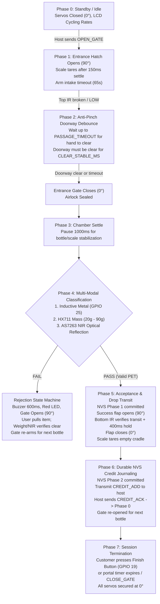

# VMC ECO-VENDO ESP32 Chute Operational Logic & Issues Audit
> **Authoritative Technical Memory & Engineering Review**  
> **Target Subsystem:** ESP32 Reverse Vending Machine Chute (`src/main.cpp`, `src/machine_config.h`, `host/portal.py`, `host/system_logger.py`, `host/time_portal.py`)  
> **Firmware Release Baseline:** v2.3.18 / v2.3.19  
> **Audit Date & Timestamp:** 2026-10-06 15:05:00 +08:00  

---

## 1. Executive Summary & Hardware Architecture

The VMC ECO-VENDO Reverse Vending Machine utilizes a distributed architecture consisting of an **Orange Pi One (Allwinner H3 / Python 3.5.3)** host controller managing captive network access, billing, and user interfaces, paired with an **ESP32 DevKit V1 (Xtensa LX6 240MHz)** dedicated real-time chute microcontroller.

### 1.1 Dual-Core FreeRTOS Task Separation
To guarantee deterministic sub-millisecond servo positioning, accurate 24-bit load cell ADC conversion, and continuous optical spectroscopy without RTOS interrupt jitter, the ESP32 segregates workloads across cores:

```
                  ┌─────────────────────────────────────────────────────────┐
                  │                 ESP32 FIRMWARE TOPOLOGY                 │
                  ├────────────────────────────┬────────────────────────────┤
                  │     CORE 0 (Priority 2)    │    CORE 1 (Priority 1)     │
                  │        SensorTask          │     CommTask & loop()      │
                  ├────────────────────────────┼────────────────────────────┤
                  │ • PCA9685 I2C Servo Drive  │ • UART 115200 Command I/O  │
                  │ • Top IR Intake Doorway    │ • JSON Parsing & Emission  │
                  │ • Bottom IR Drop Transit   │ • Front Finish Button ISR  │
                  │ • HX711 Scale Sampling     │ • 20x4 I2C LCD Display     │
                  │ • AS7263 NIR Spectroscopy  │ • Dynamic Promo Rate Cycle │
                  │ • LJ12A3 Inductive Metal   │ • NVS Preferences Storage  │
                  │ • HC-SR04 Ultrasonic Bin   │ • Watchdog Heartbeats      │
                  └────────────────────────────┴────────────────────────────┘
```

> **RF Isolation Rule:**  
> All Wi-Fi and Bluetooth radios (`esp_wifi_stop`, `esp_wifi_deinit`, `esp_bt_controller_disable`) are shut down at boot. This eliminates RF-induced ADC noise, RF antenna EMF on the HX711 cantilever lines, and FreeRTOS Wi-Fi task preemption.

### 1.2 Physical Pinout & Actuator Mapping
- **PCA9685 I2C (`0x40`):**
  - Channel 0: Entrance Gate Servo ($0^\circ$ closed, $90^\circ$ open).
  - Channel 1: Success Drop Flap Servo ($0^\circ$ closed, $90^\circ$ open).
  - 50Hz PWM calibration: `SERVOMIN = 102` (500µs pulse), `SERVOMAX = 512` (2500µs pulse).
- **Intake Sensor (Top IR):** E18-D80NK optical reflection sensor on `GPIO 32` (beam break `LOW`).
- **Drop Transit Sensor (Bottom IR):** E18-D80NK optical sensor on `GPIO 33` (transit `LOW`).
- **Inductive Proximity Sensor:** LJ12A3-4-Z/BX on `GPIO 25` (`LOW = Metal`).
- **Load Cell Amplifier:** HX711 24-bit ADC on `GPIO 15` (DOUT), `GPIO 4` (SCK). Calibration factor: 260.0 pulses/gram.
- **NIR Multi-Spectral Sensor:** SparkFun AS7263 6-channel NIR on I2C (`0x49`). Integration: 140ms, Gain: 64x, Bulb current: 50mA.
- **Bin Level Sensor:** HC-SR04 Ultrasonic on `GPIO 23` (Trig), `GPIO 27` (Echo).
- **User Interface:** Front Finish Button on `GPIO 19` (Pull-Up), Buzzer on `GPIO 18`, Green LED on `GPIO 5`, Red LED on `GPIO 17`, 20x4 LCD on I2C (`0x27`).

---

## 2. Actual Session Operational Logic (Phases 0–7)



### Phase 0: Standby & Dynamic Rate Rotation
- Gate servo ($0^\circ$) and drop flap ($0^\circ$) are locked.
- LCD rows 1 & 2 display machine readiness (`=== VMC ECO-VENDO ==`, `Ready for Deposit`).
- LCD rows 3 & 4 cycle dynamic pricing packages every 2.5s (`RATE_CYCLE_INTERVAL_MS`).
- ESP32 emits periodic telemetry heartbeats every 3.0s containing bin distance and sensor health.

### Phase 1: Intake Unlock & Scale Zero-Tare
- Customer connects via Wi-Fi captive portal and requests a deposit.
- Gateway transmits: `{"cmd":"OPEN_GATE","session_id":"<UUID>","timeout":65,"protocol":2}`.
- Core 1 verifies session token, resets session bottle accumulator if new session, and raises `entranceGateRequested = true`.
- Core 0 rotates Entrance Gate (PCA9685 Channel 0) to $90^\circ$ (`ent_open_angle`).
- Drop flap (Channel 1) is confirmed locked at $0^\circ$.
- Firm tare settle: pauses **150ms** for mechanical servo movement vibration to dissipate, then runs `scale.tare(3)` to zero out any drift.

### Phase 2: Insertion & Doorway Passage
- Chute waits up to `requestedGateTimeout` (65s) for bottle insertion.
- When Top IR beam breaks (`PIN_IR_TOP == LOW`), insertion is detected.
- **Passage Clearance Loop:** Chute does not immediately snap closed. It monitors the entrance doorway to ensure the user's hand and the bottle have passed inside.
- Once the doorway beam remains unbroken (`HIGH`) continuously for `CLEAR_STABLE_MS`, the entrance hatch smoothly rotates to $0^\circ$ (`ent_close_angle`).

### Phase 3: Chamber Settle
- Actuators remain stationary for `settle_time_ms` (1000ms).
- Eliminates momentum, bottle rolling, and load cell cantilever spring resonance.

### Phase 4: Multi-Modal Sensor Fusion
1. **Inductive Metal Sensor (`GPIO 25`):**
   - Active `LOW`. Detects aluminum cans, tinplate, iron caps, and metal foil wraps.
   - If metal is detected $\rightarrow$ Immediate rejection (`MSG_REJECT_TIN`).
2. **HX711 Mass Discrimination:**
   - 5-sample average (`scale.get_units(5)`).
   - Valid window: `[20.0g - 90.0g]`.
   - Rejects paper cups, wrappers, or light trash ($<20\text{g}$).
   - **Glass Separation:** Clear glass bottles ($n=1.51$) and clear PET ($n=1.57$) share identical ~4% Fresnel reflectance at 860nm; NIR alone cannot distinguish smooth clear glass from PET. The scale serves as the authoritative discriminator: commercial glass bottles weigh $>150\text{g}$ (typically $250\text{g} - 450\text{g}$), safely rejected by the $90\text{g}$ ceiling.
3. **AS7263 Optical Spectroscopy:**
   - Evaluated on valid-weight objects.
   - 50mA incandescent filament is powered for **40ms** warm-up.
   - Measures 6 spectral bands: R (610nm), S (680nm), T (730nm), U (760nm), V (810nm), W (860nm).
   - Calibrated W channel irradiance must fall within `[10.0 - 120.0] µW/cm²`.
   - Colored glass absorbs NIR ($<22.0\text{ µW/cm}^2$).
   - Cardboard and paper cups cause intense diffuse scattering ($>120.0\text{ µW/cm}^2$).
   - Spectral noise floor bounds: $R \ge 100, S \ge 50, V \ge 15, W \ge 10$.

### Phase 5: Acceptance & Drop Transit
1. **Pre-commit:** Writes `phase = 1` into NVS flash (`CreditJournal`).
2. **Actuation:** Drop flap servo rotates to $90^\circ$ (`suc_open_angle`).
3. **Optical Transit:** Bottom IR sensor (`PIN_IR_BOTTOM` / `GPIO 33`) verifies the falling bottle breaks the beam (`LOW`) and completely clears it (`HIGH`) for at least **400ms** (`CLEAR_HOLD_MS`).
4. **Flap Closure:** Drop flap returns to $0^\circ$.
5. **Commit:** NVS updates to `phase = 2` (accepted) and increments bottle tally.
6. **Post-Drop Tare:** `scale.tare(3)` zeroes the empty cradle.

### Phase 6: Durable Credit Journaling & Replay Handshake
- ESP32 emits: `{"event":"CREDIT_ADD","event_id":"<MAC:SESSION:SEQ>","bottles":1,"sessionTotal":N,"protocol":2}`.
- Linux host gateway awards credit to the user's MAC, updates SQLite, and replies: `{"cmd":"CREDIT_ACK","event_id":"...","protocol":2}`.
- ESP32 clears phase to `0`. If host is slow or serial was interrupted, `replayCredit()` periodically resends the receipt until ACK is received.

### Phase 7: Session Termination
- Initiated either by the customer pressing the Front Finish Button (`GPIO 19`), or the host timeout / done endpoint.
- Gates are held secured at $0^\circ$, LCD returns to Standby.

---

## 3. Comprehensive Audit of Issues, Gaps & Edge Cases

### Issue 1: Production Build Debug Stripping vs. Chute Sequence Tracker
- **Severity:** High (Diagnostic & Telemetry)
- **Mechanism:**  
  `platformio.ini` defines `-DPRODUCTION_RELEASE -DNDEBUG`, turning all `logDebug()` calls in `src/main.cpp` into no-ops. In `host/portal.py`, intermediate stages of `ChuteSequenceTracker` (`on_intake_triggered`, `on_drop_actuated`) were hooked to plaintext strings in `logDebug` (e.g. `'Top IR beam broken'`, `'Opening success flap'`).
- **Effect:**  
  During live customer sessions, intermediate debug logs are never emitted over UART. The tracker receives `GATE_OPEN`, skips stages 2 through 5, and jumps directly to `CREDIT_ADD` (Stage 6).
- **Remediation:**  
  In production, intermediate events should either be signaled via compact JSON frames or the tracker should synthesize legitimate progression between `GATE_OPEN` and `CREDIT_ADD` without relying on stripped debug strings.

### Issue 2: Incomplete `ITEM_CLEARED` Event Handling on Gateway Host
- **Severity:** Medium (State Desynchronization)
- **Mechanism:**  
  When an invalid bottle is rejected, ESP32 emits `REJECTED`, turns on the red LED and buzzer, and opens the entrance hatch for manual retrieval. When the user removes the item, ESP32 emits `{"event":"ITEM_CLEARED"}` and re-arms the entrance gate.  
  While `host/time_portal.py` clears its internal rejection tracking on `ITEM_CLEARED`, `host/portal.py`'s `handle_physical_esp32_packet()` lacks an `elif ev == 'ITEM_CLEARED':` branch.
- **Effect:**  
  `physical_esp32_state['last_event']` remains displayed as `'Rejected (...)'` and `chute_tracker` is not notified that the item was retrieved, leaving the Admin UI badge red until an auto-reset timer triggers.
- **Remediation:**  
  Add `elif ev == 'ITEM_CLEARED':` in `portal.py` to reset `physical_esp32_state['last_event']` to `'Item Cleared'` and notify `chute_tracker`.

### Issue 3: Long PET Bottle Insertion Mechanics & Top IR Occlusion Dynamics
- **Severity:** Medium (Operational Timing & User Experience)
- **Mechanism:**  
  Commercial PET bottles vary widely in physical length:
  - 330ml / 500ml standard bottles: 18cm – 22cm.
  - 1.0L / 1.5L / 2.0L large bottles: 28cm – 34cm.
  In a compact airlock chute, when a 1.5L or 2.0L bottle is inserted, the body rests in the cradle while the neck or base may remain positioned in the optical beam path of the Top IR sensor (`PIN_IR_TOP`).
- **The Timing Consequence:**  
  If the firmware expects the Top IR beam to be completely unbroken (`HIGH`) for `CLEAR_STABLE_MS` (500ms) before allowing the gate to close:
  1. For a standard bottle, the hand inserts the bottle, drops it in, the hand pulls back, the beam goes `HIGH`, stabilizes for 500ms, and the gate closes in ~1.2s.
  2. For a long bottle, the bottle body itself continues to break the Top IR beam even after the customer's hand has fully retracted!
  3. Consequently, `clearStartTime` continuously resets to 0. The firmware is forced to wait out the entire `PASSAGE_TIMEOUT_MS` (8000ms) before the timeout expires and the gate closes.
  4. This creates an 8-second perceived "hang" or freeze for the customer whenever depositing long bottles.
- **Design Decision & Timing Optimization:**  
  - **Do NOT implement a gate-closing abort interlock (P1 rejected):** If gate closing was aborted while Top IR is broken, long bottles would *never* close the door and would permanently stall the vending cycle.
  - **Optimal Passage Timings:**  
    - Reduce `PASSAGE_TIMEOUT_MS` from **8000ms** to **2800ms**.
    - Reduce `CLEAR_STABLE_MS` from **500ms** to **350ms**.
    - Rationale: A human hand retraction takes 400ms–800ms. If a long bottle keeps the beam broken, the machine only waits 2.8 seconds instead of 8.0 seconds before closing the door safely, completely eliminating the sluggishness.

### Issue 4: HX711 Load Cell Tare Timing
- **Severity:** Medium (Measurement Accuracy)
- **Mechanism:**  
  Tare occurs 150ms after the entrance gate servo is commanded to open.
- **The Long Bottle Context:**  
  If a customer attempts to force a long bottle in while the gate is still opening, taring against a loaded cradle would shift the zero baseline. However, because `PASSAGE_TIMEOUT_MS` and post-drop taring (`completeDrop` in line 1004) re-tare the empty cradle after each drop, drift is self-correcting.
- **Design Decision:**  
  Preserve the proven tare sequence originating from commit `87c7cb7` (v2.3.17 baseline) without adding brittle beam-dependent gating that would fail on long bottles.

### Issue 5: Miniature Clear Glass (<90g) Physical Boundary
- **Severity:** Low / Inherent Physical Characteristic
- **Mechanism:**  
  Clear glass and clear PET have almost identical Fresnel reflection (~4%) at 860nm. Large glass bottles ($>150\text{g}$) are reliably rejected by the $90\text{g}$ upper scale boundary. However, small glass medicine vials or mini beverage bottles ($<90\text{g}$) would produce similar NIR and mass signatures to plastic.
- **Operational Reality:**  
  Reverse vending machines accept beverage bottles; miniature glass vials are rare in municipal bottle recycling. This remains an inherent multimodal boundary condition.

### Issue 6: Standby UI Presentation vs. Active Live Deposit
- **Severity:** Low (UI Cleanliness & Clarity)
- **Mechanism:**  
  When the machine is in Standby (`status == 'IDLE'`), `get_state()` in `host/system_logger.py` historically populated stage detail text with placeholders like `0.0g (Standby)` and `Cal-W: 0.0 uW/cm2`.
- **The Gap:**  
  Viewing operators could misinterpret these placeholder strings as active live readings.
- **Remediation:**  
  When `status == 'IDLE'`, all stage detail fields should render `--` or `Standby`.

---

## 4. Remediation & Action Plan

Based on user directives:
1. **Exclude P1 Gate Closure Abort:** Retain gate closure on timeout to ensure long PET bottles can be processed without stalling.
2. **Handle `ITEM_CLEARED` in `host/portal.py`:** Sync state so retrieved rejected bottles instantly clear the UI alert and re-arm the sequence monitor.
3. **Tune Insertion Timings for Long Bottles:** Optimize `PASSAGE_TIMEOUT_MS` (2800ms) and `CLEAR_STABLE_MS` (350ms) in `src/main.cpp` for responsive handling of long bottles.
4. **Clean Standby Diagnostics Display:** Ensure `host/system_logger.py` and `tools/sequence_logger_client.js` cleanly show `--` / `Standby` when the chute is idle.
5. **Preserve Golden Baseline:** Keep all v2.3.18 calibration values (HX711 cal factor 260.0, weight window [20–90g], NIR window [10–120], retrieval timeout 50s, gate timeout 65s) strictly intact.
