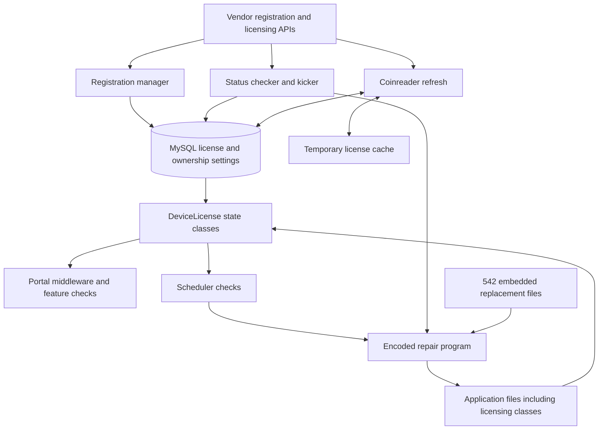

# PisoFi 5.3.0 image: static forensic audit

Inspection date: 2026-09-07 (Asia/Taipei). Target: `resources/PisoFi_Opi1&PC_v5.3.0-05-10-26_EXT.img`.

The image contains a complete PHP vending application on a Debian Stretch/Armbian system. Administrator authentication, cloud registration, licensing, hardware identity, background validation, and automatic file restoration are separate mechanisms. Restoring operating-system access alone would not remove those application dependencies.

The most consequential discovery is an encoded repair system hidden in three `.jpg` files. Its archive contains **542 replacement files**, all of which match their current target files byte for byte. A second significant finding is a scheduler branch that deletes application and support directories for a particular license value. Neither mechanism was executed during inspection.

**Image integrity:** SHA-256 matched before and after inspection. An unmounted, read-only filesystem check completed with exit status 0. The image is unmounted. No passwords, licensing checks, database records, or firmware files were changed.

## 1. Evidence and coverage

| Item | Result |
| --- | --- |
| Image bytes | 3,162,022,400 |
| SHA-256 | `d72e56563aca1af9d5e6298fa9bea5fec716a3d4d3565f6d8eabe0398f52f1dd` |
| Partition table | MBR, disk identifier `0xb9e6f63a` |
| Partition 1 | Linux type 83; sectors 8,192–6,175,824; 512-byte sectors |
| Filesystem offset | 4,194,304 bytes |
| Filesystem | ext4, UUID `e0b06b9a-4769-41f3-900c-63ae4d7a3f9b` |
| Regular files inventoried and SHA-256 hashed | 64,166 |
| Directories / symbolic links / special entries | 6,853 / 4,924 / 266, excluding the root entry |
| Initial selected evidence extraction | 6,126 files, 214,923,297 bytes |
| Installed Debian packages | 569 |
| ELF files | 4,073; every detected ELF has 32-bit ARM machine metadata |
| Readable PHP analysis copies | 479: 442 under the hidden application and 37 elsewhere |
| PHP copies with `goto` obfuscation | 56, including duplicate script copies |
| Static function declarations | 3,671 |
| Route/group declarations | 600; this includes groups and is not a count of independently verified endpoints |
| Execution-call candidates | 357; these are search candidates, not 357 confirmed vulnerabilities |
| Embedded repair archive | 542 files, 6,084,116 decoded bytes; 542 match their current targets |

The filesystem was mounted with `ro,noload` so its journal would not be replayed. Inventory traversal did not follow symlinks outside the image. All regular file contents were hashed. Selected source/configuration files were copied for analysis, PHP string escapes were decoded, and the embedded repair archive was decoded as data. No image executable, PHP script, SQL command, service, or network request was run.

Evidence:

- [Partition table](analysis/partition_table.txt), [mount options](analysis/mount.txt), [ext4 superblock](analysis/ext4_superblock.txt).
- [Before hash](analysis/image_sha256_before.txt), [after hash](analysis/image_sha256_after.txt), [read-only fsck](analysis/fsck_readonly.txt), [fsck exit status](analysis/fsck_exit_status.txt).
- [Full filesystem inventory](analysis/filesystem_inventory.tsv), [all regular-file hashes](analysis/filesystem_sha256.tsv), [selected evidence hashes](analysis/evidence_manifest.json).
- [PHP inventory](analysis/php_analysis_inventory.json), [function index](analysis/function_index.json), [route declarations](analysis/route_declarations.json), [execution candidates](analysis/execution_sinks.json).

This is a whole-filesystem static investigation with deeper review of the application and its access controls. It is not a line-by-line audit of every operating-system package, a complete ARM disassembly, a live penetration test, or deleted-file/free-space recovery. Database table files were inventoried but no live database was started and no current row values are asserted here.

## 2. Boot chain and actual operating system

The first 4 MiB contains boot material before the ext4 partition. Extracted strings identify `U-Boot SPL 2019.04-armbian` and `U-Boot 2019.04-armbian for sunxi`, with `sun8i-h3-orangepi-one` board references. `/boot` contains the `4.19.38-sunxi` kernel, initramfs, DTBs, `boot.cmd`, and `boot.scr`.

`/etc/armbian-release` identifies Armbian 5.83 and Orange Pi One. `/etc/os-release` identifies Debian GNU/Linux 9, Stretch. Package metadata corroborates that base:

| Component | Installed package version |
| --- | --- |
| Nginx | 1.10.3-1+deb9u2 |
| PHP CLI/FPM | 7.0.33-0+deb9u3 |
| MariaDB server | 10.1.38-0+deb9u1 |
| OpenSSH server | 1:7.4p1-10+deb9u6 |
| dnsmasq | 2.76-5+deb9u2 |
| NetworkManager | 1.6.2-3+deb9u2 |
| iptables | 1.6.0+snapshot20161117-6 |
| ngrok package | 3.8.0 |
| ZeroTier | 1.10.2 |

The application's `version.json` says version 5.3.0, release date 2026-04-17, and describes an upgrade to Buster. **That description does not match this filesystem's actual installed distribution.** Package versions above are local inventory observations, not a current CVE assessment.

`/boot/armbianEnv.txt` repeats `extraargs=net.ifnames=0` four times. `/etc/rc.local` contains first-boot filesystem expansion logic that can rewrite the partition table and reboot when actually booted. Its backup is essentially a no-op. Startup also calls Armbian's resize service. A future runtime test should therefore use a disposable copy.

The ext4 metadata records a previous mount at `/mnt/base_img` on 2026-09-06. The before/after hash proves this inspection did not alter the image; it does not prove that the supplied file is an untouched vendor release. No trusted vendor hash was supplied for that comparison.

Evidence: [boot strings](analysis/boot_strings.txt), [boot environment](analysis/evidence/boot/armbianEnv.txt), [OS identity](analysis/evidence/usr/lib/os-release) (the target of `/etc/os-release`), [packages](analysis/installed_packages.json), [application version](analysis/evidence/.cache/tmp/55/05/pfi/version.json), [first-boot script](analysis/evidence/etc/rc.local).

## 3. Application layout and dependencies

The main source tree is `/.cache/tmp/55/05/pfi/`, containing `app`, `bootstrap`, `resources`, `scripts`, `vendor`, and other application directories. The public front controller at `/var/www/html/pisofi/public/index.php` explicitly loads that hidden tree's `bootstrap/app.php`.

The web-root script directory is a real directory containing file copies, not a symlink to the hidden source tree. Of 32 hidden script files compared with corresponding web-root paths, 30 are byte-identical. `pfirules` and `timezones.php` differ. Service wrappers execute the `/var/www/html/pisofi/scripts` copies, so those paths matter when determining effective behavior.

The app uses Slim, Twig, Eloquent/Illuminate, Guzzle, Ratchet, React, ZeroMQ, and Python GPIO helpers. `composer.lock` describes 105 packages, including Slim 3.12.0, Twig 2.6.2, Illuminate Database 5.5.44, Guzzle 6.3.3, Ratchet 0.4.1, and Carbon 1.36.2.

Contrary to the earlier architecture report, **not all business logic is obfuscated**. Many controllers and licensing classes are readable PHP. Some daemon scripts use YAK Pro `goto` control flow and escaped strings, with headers identifying versions 1.8.1 and 2.0.5. No ionCube or Zend Guard reference was found in the 479 extracted PHP analysis copies; the inspected PHP module configuration does not enable those loaders. That is an observed scope, not a proof about every possible encoding in every file.

Evidence: [front controller](analysis/readable/var/www/html/pisofi/public/index.php.txt), [bootstrap](analysis/readable/.cache/tmp/55/05/pfi/bootstrap/app.php.txt), [Composer lock](analysis/evidence/.cache/tmp/55/05/pfi/composer.lock), [PHP inventory](analysis/php_analysis_inventory.json).

## 4. Startup and service map

All listed services run as root explicitly or implicitly, except the ngrok unit, which runs as `pi`. Five PisoFi units have direct enablement symlinks; startup starts several additional units programmatically.

| Unit suffix (`pisofi_*.service`) | Wrapper under `/home/pi/.dat/devnull/.../` | Principal role | Direct enablement link |
| --- | --- | --- | --- |
| startup | `s` | Database checks, networking, service orchestration, status check | Yes |
| rules | `r` | Firewall and traffic-control initialization | Yes |
| kicker | `k` | Session accounting, expiry, license validation, repair payload | Yes |
| server | `srv` | WebSocket and ZeroMQ event server | Yes |
| inspector | `i` | Watchdog, networking recovery, coinreader/status checks | Yes |
| cron | `cron` | Scheduled jobs, license checks, repair payload | No |
| connectionchecker | `c` | Upstream connectivity checks | No |
| harvester | `h` | Traffic statistics | No |
| coinreader | `cr` | Coin/bill GPIO input | No |
| coinreaderindicator | `cri` | Indicator management | No |
| peripheral | `ph` | Peripheral control | No |
| charging | `cgr` | Charging sessions | No |
| ngrok | `ngrok` | Web/SSH tunnels | No; startup starts it |
| datasync | `ds` | Data synchronization | No; startup explicitly disables it |
| remotebackup | `rb` | Remote backups | No |
| remotesubscriber | `rs` | Cloud event subscription | No |

The startup script waits on database/service state, starts rules/ngrok/server/inspector/connectionchecker/cron/harvester, pauses old sessions, runs `check_status`, reloads client rules, and restarts networking and dnsmasq. Some remote-backup start/stop statements are commented out. A unit's presence alone does not prove it is running.

The watchdog checks service/network state, can pause clients, resets traffic-control state, invokes the coinreader consistency check, and invokes the status checker on its configured schedule. Removing the entire watchdog would also remove operational recovery behavior.

Evidence: [service definitions and enablement](analysis/pisofi_services.json), [startup wrapper](analysis/evidence/home/pi/.dat/devnull/.../s), [watchdog](analysis/evidence/home/pi/.dat/devnull/.../i).

## 5. Network and hardware operation

| Component | Static configuration or code |
| --- | --- |
| Captive portal | Nginx HTTP port 80; portal hostname `portal.pisofiapp.com` |
| Alternate web listener | Nginx HTTP port 88 |
| WebSocket | Code binds `0.0.0.0:8080`; Nginx `/ws` proxy |
| Internal event transport | ZeroMQ code binds `tcp://*:5555`; local producers use `localhost:5555` |
| MariaDB | Port 3306, `bind-address=127.0.0.1` |
| SSH | Service enabled; root login explicitly allowed; generated firewall can block port 22 |
| DHCP | Saved dnsmasq configuration targets `eth1`, range `10.0.0.100`–`10.0.31.254`, /19, 72-hour lease |
| DNS | Portal name resolves to 10.0.0.1; saved upstreams 1.1.1.1 and 1.0.0.1 |
| Traffic enforcement | `pisofier`, generated iptables rules, `tc`, IFB interfaces, client records in MySQL |

These are configured bindings and code paths; actual reachability depends on generated firewall rules and runtime configuration. In particular, a wildcard ZeroMQ bind deserves review before exposing this image on a shared network, but external access was not tested.

Saved NetworkManager profiles contain an `eth1` static address of 10.0.0.1/19 with `autoconnect=false`, a gateway outside that subnet, and hardware-specific MAC bindings. A separate saved wired profile uses DHCP. Application network records and startup logic can regenerate configuration; these files alone do not establish the final live interface layout.

`/usr/local/bin/pins` and `pin_value_changer` are symlinks into `/usr/src/gpio`. `pins` is a shell launcher for `pins.py`, **not a compiled coin-reader executable**. The Python implementation selects Orange Pi/Raspberry Pi GPIO libraries, configures coin and bill interrupts, applies debounce/pulse settings, and publishes coin events over ZeroMQ. Native ARM GPIO extension libraries also exist. The root `/log.txt` contains repeated GPIO setup errors; these are historical evidence, not a current hardware test.

Evidence: [Nginx](analysis/evidence/etc/nginx/sites-available/default), [dnsmasq](analysis/evidence/etc/dnsmasq.conf), [saved LAN profile](analysis/evidence/etc/NetworkManager/system-connections/eth1), [event server](analysis/readable/var/www/html/pisofi/scripts/pisofi_server.php.txt), [GPIO code](analysis/evidence/usr/src/gpio/pins.py), [ELF inventory](analysis/elf_inventory.json).

## 6. Authentication and privilege boundaries

Linux has root and pi interactive accounts. `www-data` has a `nologin` shell, but its process privileges still matter. `/etc/sudoers` gives `www-data` unrestricted passwordless sudo and gives all local users passwordless access to `/bin/sh`, PHP, and several administrative commands. The root-running wrappers and much of the application are world-writable. The inventory identifies 27,925 world-writable regular files across the filesystem.

The web application validates administrator passwords through `password_verify` against its `users` records. It implements a 30-minute inactivity check and failed-login throttling. Linux account passwords, dashboard passwords, device ownership tokens, and license records are different credentials and should not be conflated.

Two source-confirmed web authentication problems stand out:

1. `bootstrap/app.php` derives session IDs from the remote IP, or the remote IP plus User-Agent, before starting the session. It temporarily disables strict session mode. These inputs do not provide a secret random session identifier. Requests sharing those inputs can share the same server-side session selection; the exact proxy/NAT exposure needs runtime verification.
2. On a failed login, `AuthController::postLogin()` passes the submitted, decrypted password to `LoginAttempt::log()`, which stores it directly in the `pass` field. Successful login truncates the failure table, but failed passwords can persist until then. No database row contents were inspected to determine whether actual passwords remain in this image.

The bootstrap also enables displayed errors, selects `development.php`, and sets `cookie_secure=0`; Nginx's inspected site has no HTTPS listener. The browser-side AES mechanism does not resolve the deterministic-session problem.

SSH has active `PermitRootLogin yes`, `PubkeyAuthentication yes`, and `UsePAM yes`. `PasswordAuthentication` and `PermitEmptyPasswords` appear as commented example/default lines, not explicit settings. The generated firewall has conditional SSH rules. Effective SSH settings and successful access were not tested.

Evidence: [sudoers](analysis/evidence/etc/sudoers), [SSH config](analysis/evidence/etc/ssh/sshd_config), [bootstrap](analysis/readable/.cache/tmp/55/05/pfi/bootstrap/app.php.txt), [Auth](analysis/readable/.cache/tmp/55/05/pfi/app/Auth/Auth.php.txt), [login controller](analysis/readable/.cache/tmp/55/05/pfi/app/Controllers/AuthController.php.txt), [failed-login model](analysis/readable/.cache/tmp/55/05/pfi/app/Models/LoginAttempt.php.txt).

## 7. Licensing and registration dependency map

The following paths are relative to `/.cache/tmp/55/05/pfi` unless stated otherwise. The matching daemon copies in `/var/www/html/pisofi/scripts` are what the wrappers execute.



| Component | Observed responsibility |
| --- | --- |
| `app/Pisofi/Server/DeviceRegistrationManager.php` | Registers device/owner with `devreg.pisofiph.com/api/v1`; stores owner, token, registration flags, license, device hash; synchronizes coinreader cache |
| `app/Pisofi/Server/DeviceLicense.php` | Loads `settings.license` JSON and selects licensed/trial/no-license state |
| `app/Pisofi/Server/License/*` | Exposes license status, expiration, and vending/desktop counts |
| `app/Middleware/DeviceConfigurationMiddleware.php` | Enforces registration and license state on attached routes; requests cloud refresh and ownership validation |
| `app/Pisofi/Server/DeviceChecker.php` | Cloud registration, token, secured license, recovery and status endpoints |
| `app/Helpers/PisofiHelper.php` | AES-CBC/HMAC response decoding and serial/license hash storage |
| `scripts/check_status` | Refreshes license; checks stored device/license hash; checks key length; sends status/telemetry |
| `scripts/kicker.php` | Also calls the cloud license validation endpoint and can clear invalid local license data |
| `scripts/cron` | Also checks license value/length and contains a destructive branch |
| `scripts/coinrdr` | Derives device identity, refreshes license, and reconciles cached/local license copies |

The local state includes `license`, `license_device_hash`, `cipher_key`, `access_token`, `registered_to`, `is_registered`, `initial_registration`, `system_registered`, `last_check_wo_net`, and an identity fallback stored as `sys_locale`.

`DeviceLicense` selects `PisofiLicense` when `licenseType` is `LICENSED`. That state's accessors return licensed/non-expiring status; trial expiration is computed from its stored dates. This local class is only one layer: the status checker, kicker, cron and coinreader can refresh or invalidate the database state independently.

The device/license binding helper stores MD5 of the device serial concatenated with the license value. Cloud response decoding uses AES-128-CBC plus HMAC-SHA256 with a locally stored `cipher_key`. The reviewed local state classes do not implement a vendor public-key signature verifier; this does not establish what the remote server validates.

The configuration middleware attempts checks after more than 14 days for licensed state, more than one day for trial state, or on expiry. Its offline branch constructs a future timestamp and uses an absolute day difference, so its displayed grace period should not be treated as a verified seven-day policy without a clock-controlled test.

`Rpi::serial()` first tries `___did___()` from `coinrdr`, then device-tree/CPU serial sources. The decoded helper can persist a generated fallback identity using the setting named `sys_locale`. Thus identity behavior is more complex than simply reading a fixed CPU serial.

The coinreader uses a cached license file in `/tmp`, encoded with ROT13 and Base64. Its consistency function compares hashes of the cached and database strings and can write cached content back into the database. Its initialization path can fetch fresh licensing data from the vendor. This is another reason a single database edit is not a durable replacement design.

Two misleading names/old checks were verified: `TrialLicenseMiddleware` is currently a pass-through, and the device-hash block in `AdminBaseController` is commented out. The checks in other components remain active source paths.

Evidence: [license references](analysis/licensing_references.json), [DeviceLicense](analysis/readable/.cache/tmp/55/05/pfi/app/Pisofi/Server/DeviceLicense.php.txt), [registration manager](analysis/readable/.cache/tmp/55/05/pfi/app/Pisofi/Server/DeviceRegistrationManager.php.txt), [configuration middleware](analysis/readable/.cache/tmp/55/05/pfi/app/Middleware/DeviceConfigurationMiddleware.php.txt), [status checker](analysis/readable/var/www/html/pisofi/scripts/check_status.txt), [kicker](analysis/readable/var/www/html/pisofi/scripts/kicker.php.txt), [symbolic coinreader analysis](analysis/coinreader_symbolic.php.txt).

## 8. Hidden repair archive and destructive branch

### Encoded code in image-named assets

Both `scripts/cron` and `scripts/kicker.php` decode an obscured path, read its contents, decode ROT13/Base64, and pass the result to PHP `eval`. The decoded path is:

`/var/www/html/pisofi/public/img/user11-128x128.jpg`

That file is **3,644 bytes of encoded text**, not JPEG data. It decodes to 2,733 bytes of PHP which reads two companion files:

| Asset | Actual role |
| --- | --- |
| `user9-128x128.jpg` | Encoded replacement-file contents, 8,113,414 bytes |
| `user10-128x128.jpg` | Encoded destination-path list, 44,446 bytes |
| `user11-128x128.jpg` | Repair program loaded by the two background scripts |

The decoded program uses an approximately hourly timer, an update-in-progress marker, SHA-1 comparisons, directory creation, file writes, and recursive permission changes. It can restore modified files from the embedded copies. The replacement archive covers 542 application/controller/model/middleware/template/bootstrap files. **Every decoded replacement hash matches its current destination in this image.** The licensing classes, configuration middleware, and web bootstrap are among the protected paths.

This is a direct explanation for changes unexpectedly reverting. It also makes the writable asset and its root-running consumers an important trust boundary. The program and archive were decoded into inert analysis files, with numbered output filenames; archived destination paths were never used as write destinations.

The asset signature sweep found eight mismatches: the three encoded assets in two locations, a JPEG named `custom.png`, and an intentionally invalid image in a validation-library test fixture. This distinguishes the confirmed encoded program from harmless format mismatches.

Evidence: [decoded repair program](analysis/embedded_payload.decoded.php.txt), [payload metadata](analysis/embedded_payload_metadata.json), [542-entry repair manifest](analysis/repair_archive_manifest.json), [asset signature findings](analysis/asset_magic_anomalies.json). Entry bytes are in `analysis/repair_archive/`.

### Destructive license branch

In the decoded scheduler, the branch testing whether the lowercased/trimmed license value equals `hack3d` leads to recursive deletion commands for `/var/www/html/pisofi`, `/usr/src/gpio`, `/usr/local/bin`, `/home/pi/.dat/devnull/...`, `/usr/src/pfi`, and `/.cache/tmp/55/05`. This is source-confirmed destructive behavior, not merely an inference from a string elsewhere in the image.

The scheduler is started by the startup wrapper and runs as root. The branch was not triggered or tested. Its presence makes arbitrary trial license values unsafe during any future runtime experiment.

Evidence: [active scheduler analysis](analysis/readable/var/www/html/pisofi/scripts/cron.txt), particularly analysis lines 49–78.

## 9. Update, verifier, and command-execution surfaces

`SystemVerifier` retrieves a version/device-specific program from the vendor API. `ToolsController::runVerifier()` downloads it to a temporary path, checks for a marker string, marks it executable, and launches it through sudo. `applyPatch()` follows a similar pattern with a different marker. In those reviewed paths, a marker check is the local content acceptance check; no public-key signature validation appears before execution.

`applyPatch()` also puts the request's `patch` value into a shell command without shell escaping. `speedtestPost()` puts the request's `server` value into another shell command without escaping. These are concrete command-injection candidates in authenticated administrative routes. They were not exercised, and this report does not claim unauthenticated reachability.

`PackageManager` can unpack application updates, replace files, execute supplied shell commands/scripts, run database updates and invoke Composer. Existing updates and the hidden repair mechanism could overwrite a custom licensing implementation unless their behavior is explicitly accounted for.

Evidence: [ToolsController](analysis/readable/.cache/tmp/55/05/pfi/app/Controllers/ToolsController.php.txt), [SystemVerifier](analysis/readable/.cache/tmp/55/05/pfi/app/Pisofi/Server/SystemVerifier.php.txt), [PackageManager](analysis/readable/.cache/tmp/55/05/pfi/app/Pisofi/Server/PackageManager.php.txt), [route source](analysis/readable/.cache/tmp/55/05/pfi/app/Routes/web.php.txt).

## 10. Remote services and outbound dependencies

| Mechanism | Evidence and qualification |
| --- | --- |
| Vendor API | Default request host `https://pisofiph.com/api`; licensing, ownership, updates, recovery and status |
| Registration API | `https://devreg.pisofiph.com/api/v1` |
| Status telemetry | Status script sends device identity/license in its URL and system/version/site/WAN/geolocation data in the request |
| ngrok | Startup launches web port 88 and SSH port 22 tunnels; saved token is the literal placeholder `NGROK_TOKEN`, so configuration presence does not prove working tunnels |
| ZeroTier | Package, enabled unit link, identity files and state directory exist; no live membership/reachability test performed |
| Remote event subscriber | Redis connection details come from `backup_server`; subscribes to a device-specific topic; handlers include reboot, shutdown and data requests; subscriber unit lacks a direct enablement link |
| Other integrations | Source references time/IP services, Google APIs, OneSignal, Coins services and PisoFi Labs; not all URL literals represent an active request |

Cloud message handlers do not establish an unauthenticated backdoor by themselves: actual access depends on service activation, provisioned credentials, and server-side control. Likewise, a disabled remote-backup unit does not eliminate separate vendor API calls made by other running components.

Evidence: [request client](analysis/readable/.cache/tmp/55/05/pfi/app/Pisofi/Server/PisofiServerRequest.php.txt), [remote event manager](analysis/readable/.cache/tmp/55/05/pfi/app/Pisofi/Server/ServerEventManager.php.txt), [event handlers](analysis/readable/.cache/tmp/55/05/pfi/app/Pisofi/Server/ServerEventHandler.php.txt), [ngrok config](analysis/evidence/home/pi/.ngrok2/ngrok.yml), [URL-literal index](analysis/url_literals.json).

## 11. Database and persistent state

The image includes the MariaDB system tablespace, redo logs, system database and a `pisofi` directory with 44 `.frm`/`.ibd` table pairs plus `db.opt` (89 files). Configuration enables per-table InnoDB storage. The shared `ibdata1` is approximately 204 MiB. A rebuild must account for the whole consistent database state, not simply copy isolated `.ibd` files.

Tables present:

```text
active_clients, charging_clients, charging_rates, chat_messages,
client_accounts, client_devices, client_rewards, client_sessions,
connection_sessions, data_expirations, data_rates, desktop_clients,
desktop_rates, device_mac_binding, eload_transactions, insert_coin_logs,
inventory, login_attempts, networks, notification_messages,
old_charging_clients, old_client_sessions, old_clients,
old_connection_sessions, old_tickets, ports, pppoe_clients, promo_rates,
rates, resellers, settings, system_activity, tenant_data,
tenant_data_archives, tickets, time_expirations, time_transfers, traffics,
usages, user_activity, user_for_logout, users, vendo_sessions,
wallet_transactions
```

The `settings` model and its consumers cover license/ownership state, service configuration, network settings, portal behavior and device identity. The `users` table is distinct from Linux `/etc/shadow`; client accounts are another separate table. Table names show storage coverage but not whether tables currently contain customer data.

Database credentials are present in `/etc/environment`, and the coinreader has matching hard-coded connection values. Existing root/pi shell and Git credential-history files checked in the inventory are zero bytes. ZeroTier identity secrets and SSH host-key files also exist; their contents were not copied into the new selected evidence bundle. The earlier `extracted_configs/shadow` remains in the folder from the previous inspection.

Evidence: [database file inventory](analysis/database_file_inventory.json), [database configuration](analysis/evidence/etc/mysql/mariadb.conf.d/50-server.cnf), [settings model](analysis/readable/.cache/tmp/55/05/pfi/app/Models/PisofiSetting.php.txt), [inventory](analysis/filesystem_inventory.tsv).

## 12. Prioritized findings

| Priority | Finding | Practical consequence | Verification level |
| --- | --- | --- | --- |
| Critical | All local users can invoke a root shell through sudo; web user has unrestricted sudo | Linux privilege separation is ineffective for these principals | Extracted configuration |
| Critical | Scheduler contains license-triggered recursive deletion | A particular state can destroy the installed application and support tools | Static branch traced; not executed |
| High | Root-running daemons evaluate encoded PHP from a writable web asset | File write access reaches a privileged code path | Static call chain and payload decoded |
| High | 542-file automatic repair archive | Local application changes can be overwritten later | All embedded target hashes verified |
| High | Deterministic web session identifiers | Session selection depends on predictable/shared request attributes | Source confirmed; live effect untested |
| High | Failed submitted passwords stored in database | Failed login attempts can retain plaintext credentials | Controller/model call chain confirmed |
| High | Unescaped administrative patch/speedtest parameters | Authenticated command-injection candidates with root impact | Source confirmed; not exploited |
| High | Downloaded verifier/patch launched with root privileges after marker checks | Remote delivery becomes a privileged code-update trust boundary | Source confirmed |
| Review | Wildcard ZeroMQ bind, remote tunnels and ZeroTier state | Network access requires explicit reachability and credential review | Configuration/source only |
| Review | Version metadata disagrees with actual distribution | Rebuild assumptions and dependency choices can be wrong | OS/package metadata confirmed |
| Review | Saved network profiles bind to specific MACs and contain unusual LAN settings | A cloned image may configure different hardware unexpectedly | Saved configuration only |

## 13. Implications for the requested recovery and custom licensing work

The image is inspectable and many application classes are available as PHP source. A faithful modification is technically different from the existing `build_ecofi_img.sh`, which removes PisoFi's application, database and supporting services and installs EcoFi.

A future preserving rebuild needs an explicit design for these separate responsibilities:

1. Linux administrator access and SSH reachability.
2. Dashboard authentication and credential recovery.
3. Ownership/registration state and a local replacement license verifier.
4. Consistent behavior across the portal, kicker, cron, status checker and coinreader cache.
5. The 542-file repair archive and vendor update/verifier behavior.
6. Device identity, GPIO, vending/session accounting and database migration.
7. Recovery access when a custom license expires or becomes invalid.

For the project's own replacement licensing, `host/license_manager.py` is a prototype rather than a strong signing boundary: the same embedded secret and activation calculation are shipped on the device, expiry is outside the activation calculation, and a local hardware-ID override exists. A signed license format with an off-device private key would need to cover the device ID, features/tier and expiration consistently. This audit did not implement that replacement or choose an expiration policy.

Any later runtime validation should check boot completion, initial registration, login/logout, service restarts, offline periods, clock changes, coin crediting, session expiry, updates, and behavior after the repair timer. Merely reaching the dashboard would not establish a complete working rebuild.

## 14. Corrections to earlier local reports

- Much of the application is readable PHP; blanket claims that all business logic is obfuscated are incorrect.
- The active public front controller explicitly includes the hidden bootstrap. The public tree is not simply a symlink to the hidden tree.
- `pins` is a shell/Python path, not a compiled coin-reader binary.
- `www-data` is not an interactive account, though its sudo privileges are severe.
- Commented SSH defaults must not be represented as explicit settings. The earlier empty-password recovery suggestion was not validated.
- Presence of ngrok configuration does not establish a working remote tunnel; its saved token is a placeholder.
- License checks in `AdminBaseController` and the remote validation event handler are commented out, while other independent checks are active source paths.
- The old report did not document the 542-file embedded repair archive, the evaluated JPEG-named payload, or the scheduler's destructive license branch.

## 15. Reproduction and limits

The inspection scripts are kept beside this report: `inspect_image.sh`, `inventory_image.py`, `extract_evidence.py`, `deep_inventory.py`, `index_sources.py`, `decode_embedded.py`, `enrich_evidence.py`, and `verify_image.sh`. `run_full_inspection.sh` runs them in order using Ubuntu WSL and the fixed project/image paths shown above.

Readable `.php.txt` files are analysis derivatives, not executable replacements or fully reconstructed source. Formatting preserves the original `goto` structure; the symbolic coinreader copy substitutes a decoded function table for inspection and is deliberately not runnable. Embedded archive entries have neutral numbered filenames.

Generated evidence is excluded from Git by `analysis/.gitignore`. It can contain proprietary source and configuration credentials. No external services were contacted and no new image was built. No assertion is made about current vendor servers, vendor-release authenticity, current device state, live licensing validity, customer records, or every possible vulnerability in the operating system and bundled dependencies.
